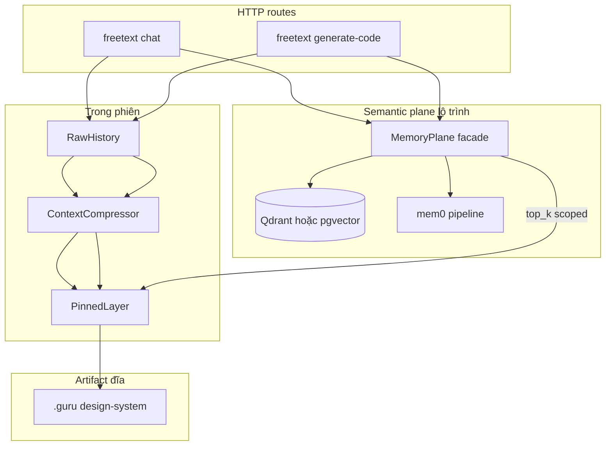
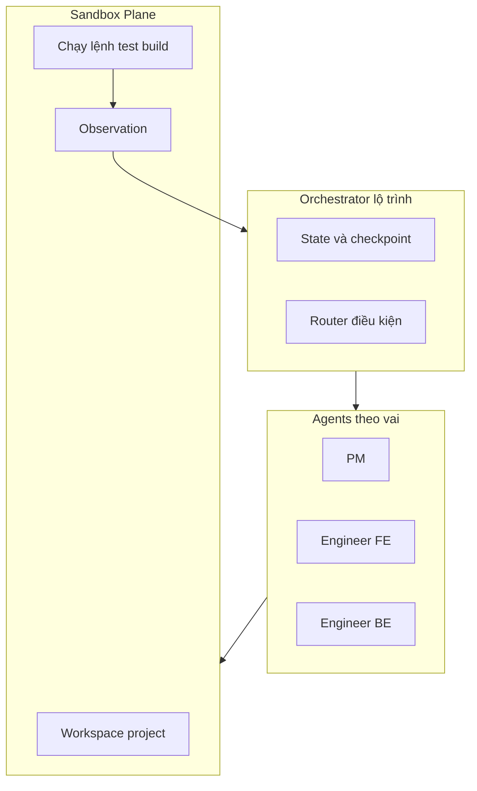
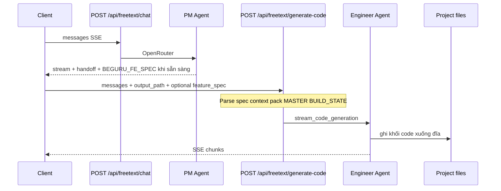
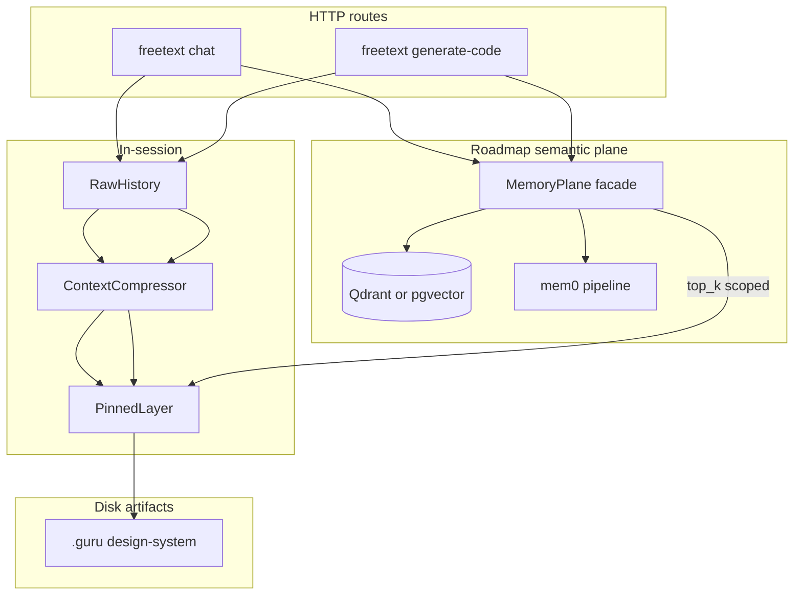
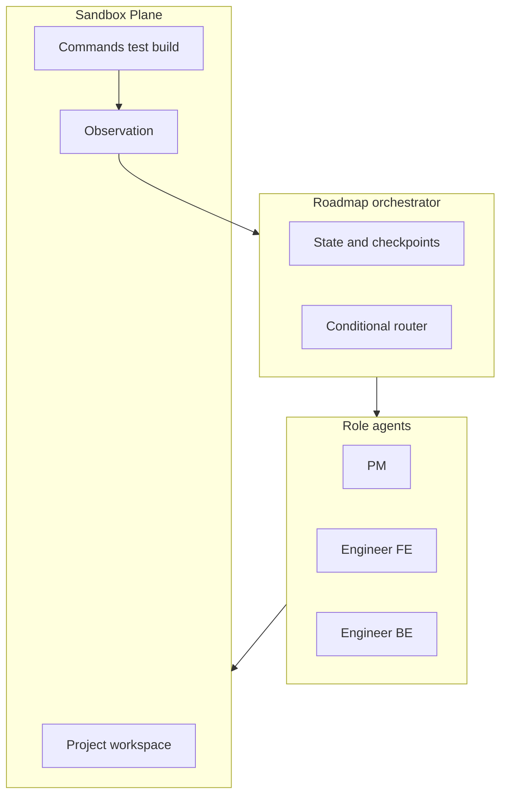
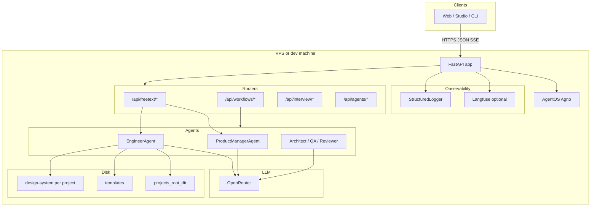
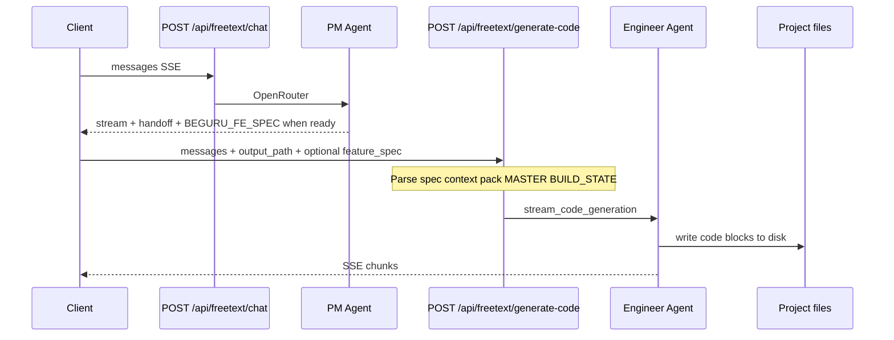

> **Chuỗi BeGuru — Technical Docs**  
> [0. Tổng quan](/blog/beguru-ai-architecture-overview) · [1. Design & đĩa](/blog/beguru-ai-case-study-design-system-disk) · [2. Runtime](/blog/beguru-ai-case-study-runtime-fastapi-agentos) · [3. Memory & context](/blog/beguru-ai-case-study-memory-context-layers) · [4. Mem0 & cross-session](/blog/beguru-ai-mem0-integration-architecture) · [5. Technical Narrative](/blog/beguru-ai-technical-narrative)

## VI

### Tóm lược

- **BeGuru AI** (service `beguru-ai`) là backend **FastAPI** gắn **AgentOS (Agno)**; các route `/api/freetext/*`, `/api/workflows/*`, … điều phối **PM** và **Engineer** gọi LLM qua **OpenRouter**, ghi kết quả xuống **`projects_root_dir`** (Next.js / Go) cùng cây **`design-system/`** trong mỗi project FE.
- **Tài liệu gốc (SSOT)** trong repo: `docs/ARCHITECTURE_RUNTIME.md`, `docs/MEMORY_AND_CONTEXT_LAYERS.md`, `docs/API_SPEC.md`.
- **Thứ tự đọc đề xuất:** bài này (map) → [Design & đĩa](/blog/beguru-ai-case-study-design-system-disk) → [Runtime](/blog/beguru-ai-case-study-runtime-fastapi-agentos) → [Memory](/blog/beguru-ai-case-study-memory-context-layers) → [Mem0 & cross-session](/blog/beguru-ai-mem0-integration-architecture) → [Technical Narrative](/blog/beguru-ai-technical-narrative) (mental model & SSOT tóm tắt).

### Hiện trạng vs hướng đi (North Star)

**Hiện tại** hệ chạy theo **request–response / SSE**: client gửi `messages`, server nén context (`ContextCompressor`), ghim pins, Engineer ghi file + (tuỳ flow) kiểm tra tĩnh — **chưa** có graph điều phối đa bước bắt buộc hay sandbox chạy lệnh thống nhất giữa mọi route.

**Hướng sản phẩm** (đối chiếu các assistant dạng **Claude Code**): **autonomous coding** cần vòng lặp **Plan → sửa/ghi đĩa → chạy lệnh trong môi trường cách ly → quan sát stdout/exit → checkpoint**, có thể **đa agent** (PM, Engineer FE, Engineer BE) với handoff có contract (spec, BUILD_STATE, API). Kiến trúc tham chiếu trong ecosystem thường dùng **LangGraph** (hoặc tương đương) cho **state + routing có điều kiện + checkpoint**; ví dụ case study production với **8 agent**, orchestrator–worker, sandbox modal, middleware và caching — xem [FRE|Nxt × InterviewLM — LangGraph multi-agent](https://www.frenxt.com/case-studies/langgraph-multi-agent) *(bài ngoài, không phải BeGuru)*.

BeGuru **không** cam kết đã triển khai đủ các lớp đó; bài [Mem0 & cross-session](/blog/beguru-ai-mem0-integration-architecture) mô tả **một** mảnh lộ trình (memory ngữ nghĩa + Qdrant). Khi spike, nên đo **latency**, **chi phí**, **an toàn sandbox** trước khi gắn vào API công khai.

### Kiến trúc đề xuất (đồng bộ product plan)

**Nguyên tắc:** **artifact-first** — file `.guru/` / `design-system` vẫn là chân lý build; nhớ ngữ nghĩa chỉ **bổ sung**. Một **MemoryPlane** (facade) phía server: route không gọi vector/mem rời rạc; chỉ `retrieve` / `commit` với phạm vi **`user_id` + `project_key`**. LLM **extract/index memory** tách khỏi LLM **codegen** (model rẻ vs model mạnh).

**Bốn tầng nhớ + semantic plane:**

**Orchestrator + sandbox (North Star):** graph có **state/checkpoint**, handoff PM → Engineer FE → Engineer BE; **Sandbox Plane** chạy `npm` / `go test` / build trong môi trường cách ly, **stdout/stderr/exit** làm quan sát cho bước tiếp.

### Tech stack đề xuất (mục tiêu lộ trình)

| Lớp | Đề xuất | Vai trò ngắn |
|-----|---------|--------------|
| **Điều phối đa bước** | **LangGraph** (Python); **Temporal** khi cần durable / chờ người / SLA dài | State, conditional edges, checkpoint; hybrid LangGraph-inside-Temporal nếu cần |
| **MemoryPlane** | Interface nội bộ; backend đầu tiên **mem0** (`AsyncMemory`) | `retrieve` / `commit` thống nhất cho PM + Engineer routes |
| **Vector store** | **Qdrant** (compose); tuỳ chọn **pgvector** nếu gom một Postgres | Semantic search memories; tenant qua `collection` / policy |
| **Sandbox** | **E2B** hoặc **Docker** + giới hạn CPU/time/network | Quan sát sau khi ghi đĩa — gần pattern [case study modal sandbox](https://www.frenxt.com/case-studies/langgraph-multi-agent) |
| **LLM** | **OpenRouter** (giữ) | Tách model rẻ cho extract memory vs model mạnh cho codegen |
| **Quan sát** | **Langfuse** (đã có) + **OpenTelemetry** → Langfuse | Trace graph, tool, sandbox span |
| **Agno** | Giữ registry / MCP / agent class; có thể thu hẹp khi logic chuyển dần sang **node graph** | Không bắt buộc big-bang thay framework |

\*Temporal: tùy spike `stack-spike` (SLO, chi phí vận hành).

### Hiện tại vs đề xuất (một bảng)

| Lớp | Hiện tại (typical) | Đề xuất mục tiêu |
|-----|-------------------|------------------|
| Điều phối | Route FastAPI + stream trực tiếp | LangGraph (+ Temporal khi cần) |
| Nhớ xuyên phiên | Chưa / từng spike mem0 | MemoryPlane → mem0 + Qdrant |
| Kiểm chứng tự động | Static check cục bộ trong flow | Sandbox Plane + vòng Observe |
| Quan sát | Logger + Langfuse tuỳ chọn | Langfuse + OTel end-to-end |

### Mục đích và phạm vi

Bài này **không** thay thế OpenAPI hay tài liệu nội bộ đầy đủ; nó cố định **bối cảnh kiến trúc** và **chỗ các bộ phận gắn với nhau** để đọc tiếp các bài chuyên sâu.

:::warning[Phạm vi]
Luôn đối chiếu repo `beguru-ai` (`docs/API_SPEC.md`, …) với version bạn đang chạy — blog có thể tóm tắt lệch thời điểm.
:::

### Sơ đồ tổng quan (runtime)

### Bảng thành phần

| Thành phần | Vai trò | Ghi chú / artifact | Bài liên quan |
|------------|---------|-------------------|---------------|
| **FastAPI** | HTTP server, CORS, logging, `/health` | `src.api.main` | [Runtime](/blog/beguru-ai-case-study-runtime-fastapi-agentos) |
| **AgentOS (Agno)** | Registry agent, khởi tạo framework agent | Cùng process với API | [Runtime](/blog/beguru-ai-case-study-runtime-fastapi-agentos) |
| **Routers** | `freetext`, `workflows`, `interview`, `agents` | Include từ `main.py` | [Runtime](/blog/beguru-ai-case-study-runtime-fastapi-agentos) |
| **PM Agent** | Thảo luận spec, handoff `LABEL_*`, khối `## BEGURU_FE_SPEC` / BE | Stream SSE | [Runtime](/blog/beguru-ai-case-study-runtime-fastapi-agentos) |
| **Engineer Agent** | `generate-code`, `edit-code`, `generate-backend` (Go) | Ghi file theo `output_path` | [Runtime](/blog/beguru-ai-case-study-runtime-fastapi-agentos), [Design & đĩa](/blog/beguru-ai-case-study-design-system-disk) |
| **OpenRouter** | Gateway tới các model; attribution header (Referer / title) | Env model trong Settings | [Runtime](/blog/beguru-ai-case-study-runtime-fastapi-agentos) |
| **Artifact đĩa** | `MASTER.md`, `BUILD_STATE.md`, `PRODUCT_PLAN.md`, `beguru_chat_context.json` | Dưới `design-system/` mỗi project | [Design & đĩa](/blog/beguru-ai-case-study-design-system-disk) |
| **Context pipeline** | Nén history, ghim pins, context pack cho Engineer | `ContextCompressor`, v.v. | [Memory](/blog/beguru-ai-case-study-memory-context-layers) |
| **SQLite (Agno)** | Session / workflow / optional persist summary | `data/agno.db` (cấu hình tuỳ môi trường) | [Memory](/blog/beguru-ai-case-study-memory-context-layers) |
| **Memory xuyên phiên (lộ trình)** | Facts theo `user_id`, semantic search | mem0 + Qdrant, inject ở route — xem bài Mem0 | [Mem0 & cross-session](/blog/beguru-ai-mem0-integration-architecture) |

### Tech stack hiện tại (điển hình)

| Lớp | Công nghệ |
|-----|-----------|
| Runtime | Python, FastAPI, Uvicorn |
| Agents | Agno AgentOS, agents PM / Engineer / … |
| LLM | OpenRouter (model cấu hình qua `.env` / Settings) |
| Output FE | Template Next.js (`templates/guru-nextjs-template`), rule `.guru/rules/` |
| Output BE | Template Go (`templates/beguru-go-template-be`), pipeline `init-go-project` → `backend-spec/*` → `generate-backend` |
| Quan sát | StructuredLogger; Langfuse tuỳ chọn |
| Lộ trình | Xem mục **Kiến trúc đề xuất** và **Tech stack đề xuất** phía trên |

### Luồng sản phẩm chính (FE trước)

Luồng Go backend (sau FE, có gate `backend-spec`) được mô tả trong `ARCHITECTURE_RUNTIME.md` và [bài Runtime](/blog/beguru-ai-case-study-runtime-fastapi-agentos).

### Tham chiếu trong repo `beguru-ai`

- `docs/ARCHITECTURE_RUNTIME.md` — sơ đồ, bảng thành phần, deploy điển hình.
- `docs/API_SPEC.md` — contract HTTP, `output_path`, field request/response.
- `docs/MEMORY_AND_CONTEXT_LAYERS.md` — pipeline nén, pins, artifact.

---

## EN

### At a glance

- **BeGuru AI** (`beguru-ai`) is a **FastAPI** service backed by **AgentOS (Agno)**. Routes under `/api/freetext/*`, `/api/workflows/*`, … orchestrate **PM** and **Engineer** agents calling LLMs via **OpenRouter**, persisting output under **`projects_root_dir`** (Next.js / Go) and per-project **`design-system/`** trees.
- **Source of truth** in the repo: `docs/ARCHITECTURE_RUNTIME.md`, `docs/MEMORY_AND_CONTEXT_LAYERS.md`, `docs/API_SPEC.md`.
- **Suggested reading order:** this post (map) → [Design & disk](/blog/beguru-ai-case-study-design-system-disk) → [Runtime](/blog/beguru-ai-case-study-runtime-fastapi-agentos) → [Memory](/blog/beguru-ai-case-study-memory-context-layers) → [Mem0 & cross-session](/blog/beguru-ai-mem0-integration-architecture) → [Technical Narrative](/blog/beguru-ai-technical-narrative) (mental model & SSOT summary).

### Current state vs North Star

**Today** the system is primarily **request/SSE**: clients send `messages`, the server compresses context (`ContextCompressor`), applies pins, and the Engineer writes files and may run static checks — there is **no** mandatory multi-step orchestration graph or unified command sandbox across all routes yet.

**Product direction** (benchmarks like **Claude Code**): **autonomous coding** needs a loop **Plan → edit/write disk → run commands in isolation → observe stdout/exit → checkpoint**, optionally **multi-agent** (PM, FE engineer, BE engineer) with structured handoffs (spec, BUILD_STATE, API). The wider ecosystem often uses **LangGraph** (or similar) for **state, conditional routing, and checkpoints**. An external production write-up with **8 specialized agents**, orchestrator–worker layout, modal sandbox, and middleware/caching is [FRE|Nxt × InterviewLM — LangGraph multi-agent case study](https://www.frenxt.com/case-studies/langgraph-multi-agent) *(third-party; not BeGuru)*.

BeGuru does **not** claim full implementation of those layers yet; [Mem0 & cross-session](/blog/beguru-ai-mem0-integration-architecture) describes **one** roadmap slice (semantic memory + Qdrant). Spike with **latency**, **cost**, and **sandbox safety** before binding to public API contracts.

### Proposed architecture (product plan alignment)

**Principles:** **artifact-first** — `.guru/` / `design-system` files remain the build source of truth; semantic memory is **additive**. A server-side **MemoryPlane** (facade): routes do not call vector/memory ad hoc; only `retrieve` / `commit` scoped by **`user_id` + `project_key`**. **Separate** cheap LLMs for memory extract/index from **strong** LLMs for codegen.

**Four memory layers + semantic plane:**

**Orchestrator + sandbox (North Star):** a graph with **state/checkpoints**, PM → Engineer FE → Engineer BE handoffs; a **Sandbox Plane** runs `npm` / `go test` / build in isolation; **stdout/stderr/exit** feed the next step.

### Proposed tech stack (target roadmap)

| Layer | Proposal | Short role |
|-------|----------|------------|
| **Multi-step orchestration** | **LangGraph** (Python); **Temporal** when durable execution / human waits / long SLA | State, conditional edges, checkpoints; optional LangGraph-inside-Temporal |
| **MemoryPlane** | Internal interface; first backend **mem0** (`AsyncMemory`) | Unified `retrieve` / `commit` for PM + Engineer routes |
| **Vector store** | **Qdrant** (compose); optional **pgvector** if consolidating on Postgres | Semantic memory search; tenant via collection / policy |
| **Sandbox** | **E2B** or **Docker** + CPU/time/network limits | Post-write observation — similar to [modal sandbox in this case study](https://www.frenxt.com/case-studies/langgraph-multi-agent) |
| **LLM** | **OpenRouter** (keep) | Cheap model for memory extract vs strong model for codegen |
| **Observability** | **Langfuse** (existing) + **OpenTelemetry** → Langfuse | Trace graph, tools, sandbox spans |
| **Agno** | Keep registry / MCP / agent classes; may narrow as logic moves to **graph nodes** | No mandatory big-bang framework swap |

\*Temporal: subject to `stack-spike` (SLO, ops cost).

### Current vs proposed (one table)

| Layer | Current (typical) | Target proposal |
|-------|-------------------|-------------------|
| Orchestration | FastAPI routes + direct streams | LangGraph (+ Temporal if needed) |
| Cross-session memory | Not yet / mem0 spike path | MemoryPlane → mem0 + Qdrant |
| Automated verification | Local static checks in flow | Sandbox Plane + Observe loop |
| Observability | Logger + optional Langfuse | Langfuse + OTel end-to-end |

### Purpose and scope

This post is **not** a substitute for the full OpenAPI or internal docs; it anchors **system context** and **how major pieces connect** before you read the deep dives.

:::warning[Scope]
Always verify against the `beguru-ai` repo (`docs/API_SPEC.md`, …) for the version you run — this blog may lag behind.
:::

### High-level runtime diagram

### Component map

| Component | Role | Notes / artifact | Related post |
|-----------|------|------------------|--------------|
| **FastAPI** | HTTP server, CORS, logging, `/health` | `src.api.main` | [Runtime](/blog/beguru-ai-case-study-runtime-fastapi-agentos) |
| **AgentOS (Agno)** | Agent registry, framework hooks | Same process as API | [Runtime](/blog/beguru-ai-case-study-runtime-fastapi-agentos) |
| **Routers** | `freetext`, `workflows`, `interview`, `agents` | Included from `main.py` | [Runtime](/blog/beguru-ai-case-study-runtime-fastapi-agentos) |
| **PM Agent** | Spec chat, handoff tags, `## BEGURU_FE_SPEC` | SSE stream | [Runtime](/blog/beguru-ai-case-study-runtime-fastapi-agentos) |
| **Engineer Agent** | `generate-code`, `edit-code`, `generate-backend` | Writes under `output_path` | [Runtime](/blog/beguru-ai-case-study-runtime-fastapi-agentos), [Design & disk](/blog/beguru-ai-case-study-design-system-disk) |
| **OpenRouter** | Model gateway; Referer/title attribution | Models from Settings / `.env` | [Runtime](/blog/beguru-ai-case-study-runtime-fastapi-agentos) |
| **Disk artifacts** | `MASTER.md`, `BUILD_STATE.md`, `PRODUCT_PLAN.md`, `beguru_chat_context.json` | Under each project `design-system/` | [Design & disk](/blog/beguru-ai-case-study-design-system-disk) |
| **Context pipeline** | Compress history, pins, Engineer context pack | `ContextCompressor`, etc. | [Memory](/blog/beguru-ai-case-study-memory-context-layers) |
| **SQLite (Agno)** | Sessions / workflows / optional summary persist | `data/agno.db` (env-dependent) | [Memory](/blog/beguru-ai-case-study-memory-context-layers) |
| **Cross-session memory (roadmap)** | Facts keyed by `user_id`, semantic retrieval | mem0 + Qdrant at route — see Mem0 post | [Mem0 & cross-session](/blog/beguru-ai-mem0-integration-architecture) |

### Current tech stack (typical)

| Layer | Technology |
|-------|------------|
| Runtime | Python, FastAPI, Uvicorn |
| Agents | Agno AgentOS, PM / Engineer / … |
| LLM | OpenRouter (models via `.env` / Settings) |
| FE output | Next.js template (`guru-nextjs-template`), `.guru/rules/` |
| BE output | Go template (`beguru-go-template-be`), `init-go-project` → `backend-spec/*` → `generate-backend` |
| Observability | StructuredLogger; optional Langfuse |
| Roadmap | See **Proposed architecture** and **Proposed tech stack** above |

### Primary product flow (frontend-first)

The Go backend pipeline (gates via `backend-spec`) is detailed in `ARCHITECTURE_RUNTIME.md` and the [Runtime](/blog/beguru-ai-case-study-runtime-fastapi-agentos) post.

### References in the `beguru-ai` repo

- `docs/ARCHITECTURE_RUNTIME.md` — diagrams, component table, typical deployment.
- `docs/API_SPEC.md` — HTTP contract, `output_path`, request/response fields.
- `docs/MEMORY_AND_CONTEXT_LAYERS.md` — compression, pins, artifacts.
