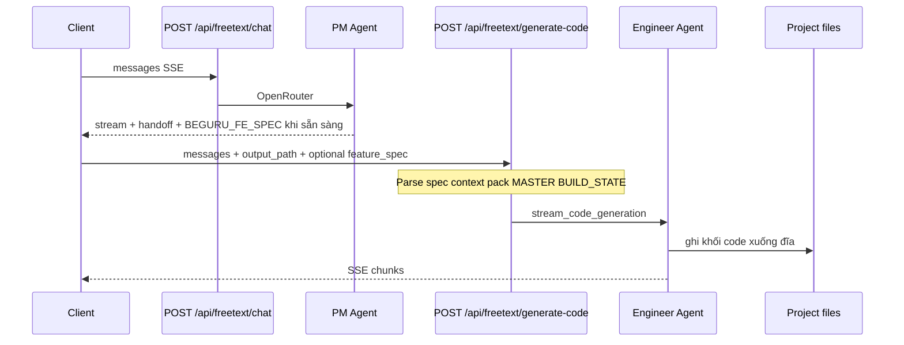
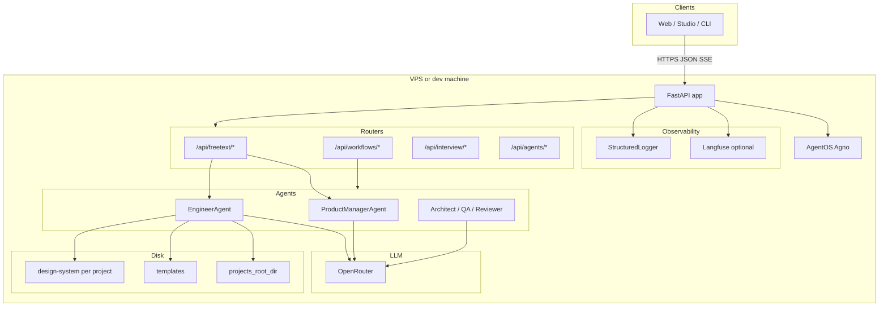
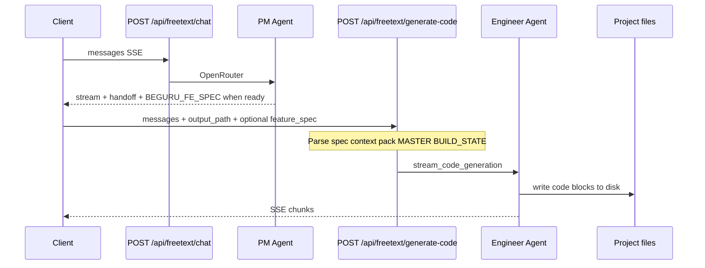

> **Chuỗi BeGuru — Technical Docs**  
> [0. Tổng quan kiến trúc](/blog/beguru-ai-architecture-overview) · [1. Design system & đĩa](/blog/beguru-ai-case-study-design-system-disk) · [2. Runtime (FastAPI, AgentOS)](/blog/beguru-ai-case-study-runtime-fastapi-agentos) · [3. Memory & context](/blog/beguru-ai-case-study-memory-context-layers)

## VI

### Tóm lược

- **BeGuru AI** (service `beguru-ai`) là backend **FastAPI** gắn **AgentOS (Agno)**; các route `/api/freetext/*`, `/api/workflows/*`, … điều phối **PM** và **Engineer** gọi LLM qua **OpenRouter**, ghi kết quả xuống **`projects_root_dir`** (Next.js / Go) cùng cây **`design-system/`** trong mỗi project FE.
- **Tài liệu gốc (SSOT)** trong repo: `docs/ARCHITECTURE_RUNTIME.md`, `docs/MEMORY_AND_CONTEXT_LAYERS.md`, `docs/API_SPEC.md`.
- **Thứ tự đọc đề xuất:** bài này (map) → [Design & đĩa](/blog/beguru-ai-case-study-design-system-disk) → [Runtime](/blog/beguru-ai-case-study-runtime-fastapi-agentos) → [Memory](/blog/beguru-ai-case-study-memory-context-layers).

### Mục đích và phạm vi

Bài này **không** thay thế OpenAPI hay tài liệu nội bộ đầy đủ; nó cố định **bối cảnh kiến trúc** và **chỗ các bộ phận gắn với nhau** để đọc tiếp các bài chuyên sâu.

### Sơ đồ tổng quan (runtime)

### Bảng thành phần

| Thành phần | Vai trò | Ghi chú / artifact | Bài liên quan |
|------------|---------|-------------------|---------------|
| **FastAPI** | HTTP server, CORS, logging, `/health` | `src.api.main` | [Runtime](/blog/beguru-ai-case-study-runtime-fastapi-agentos) |
| **AgentOS (Agno)** | Registry agent, khởi tạo framework agent | Cùng process với API | [Runtime](/blog/beguru-ai-case-study-runtime-fastapi-agentos) |
| **Routers** | `freetext`, `workflows`, `interview`, `agents` | Include từ `main.py` | [Runtime](/blog/beguru-ai-case-study-runtime-fastapi-agentos) |
| **PM Agent** | Thảo luận spec, handoff `LABEL_*`, khối `## BEGURU_FE_SPEC` / BE | Stream SSE | [Runtime](/blog/beguru-ai-case-study-runtime-fastapi-agentos) |
| **Engineer Agent** | `generate-code`, `edit-code`, `generate-backend` (Go) | Ghi file theo `output_path` | [Runtime](/blog/beguru-ai-case-study-runtime-fastapi-agentos), [Design & đĩa](/blog/beguru-ai-case-study-design-system-disk) |
| **OpenRouter** | Gateway tới các model; attribution header (Referer / title) | Env model trong Settings | [Runtime](/blog/beguru-ai-case-study-runtime-fastapi-agentos) |
| **Artifact đĩa** | `MASTER.md`, `BUILD_STATE.md`, `PRODUCT_PLAN.md`, `beguru_chat_context.json` | Dưới `design-system/` mỗi project | [Design & đĩa](/blog/beguru-ai-case-study-design-system-disk) |
| **Context pipeline** | Nén history, ghim pins, context pack cho Engineer | `ContextCompressor`, v.v. | [Memory](/blog/beguru-ai-case-study-memory-context-layers) |
| **SQLite (Agno)** | Session / workflow / optional persist summary | `data/agno.db` (cấu hình tuỳ môi trường) | [Memory](/blog/beguru-ai-case-study-memory-context-layers) |

### Tech stack (tóm tắt)

| Lớp | Công nghệ |
|-----|-----------|
| Runtime | Python, FastAPI, Uvicorn |
| Agents | Agno AgentOS, agents PM / Engineer / … |
| LLM | OpenRouter (model cấu hình qua `.env` / Settings) |
| Output FE | Template Next.js (`templates/guru-nextjs-template`), rule `.guru/rules/` |
| Output BE | Template Go (`templates/beguru-go-template-be`), pipeline `init-go-project` → `backend-spec/*` → `generate-backend` |
| Quan sát | StructuredLogger; Langfuse tuỳ chọn |

### Luồng sản phẩm chính (FE trước)

Luồng Go backend (sau FE, có gate `backend-spec`) được mô tả trong `ARCHITECTURE_RUNTIME.md` và [bài Runtime](/blog/beguru-ai-case-study-runtime-fastapi-agentos).

### Tham chiếu trong repo `beguru-ai`

- `docs/ARCHITECTURE_RUNTIME.md` — sơ đồ, bảng thành phần, deploy điển hình.
- `docs/API_SPEC.md` — contract HTTP, `output_path`, field request/response.
- `docs/MEMORY_AND_CONTEXT_LAYERS.md` — pipeline nén, pins, artifact.

---

## EN

### At a glance

- **BeGuru AI** (`beguru-ai`) is a **FastAPI** service backed by **AgentOS (Agno)**. Routes under `/api/freetext/*`, `/api/workflows/*`, … orchestrate **PM** and **Engineer** agents calling LLMs via **OpenRouter**, persisting output under **`projects_root_dir`** (Next.js / Go) and per-project **`design-system/`** trees.
- **Source of truth** in the repo: `docs/ARCHITECTURE_RUNTIME.md`, `docs/MEMORY_AND_CONTEXT_LAYERS.md`, `docs/API_SPEC.md`.
- **Suggested reading order:** this post (map) → [Design & disk](/blog/beguru-ai-case-study-design-system-disk) → [Runtime](/blog/beguru-ai-case-study-runtime-fastapi-agentos) → [Memory](/blog/beguru-ai-case-study-memory-context-layers).

### Purpose and scope

This post is **not** a substitute for the full OpenAPI or internal docs; it anchors **system context** and **how major pieces connect** before you read the deep dives.

### High-level runtime diagram

### Component map

| Component | Role | Notes / artifact | Related post |
|-----------|------|------------------|--------------|
| **FastAPI** | HTTP server, CORS, logging, `/health` | `src.api.main` | [Runtime](/blog/beguru-ai-case-study-runtime-fastapi-agentos) |
| **AgentOS (Agno)** | Agent registry, framework hooks | Same process as API | [Runtime](/blog/beguru-ai-case-study-runtime-fastapi-agentos) |
| **Routers** | `freetext`, `workflows`, `interview`, `agents` | Included from `main.py` | [Runtime](/blog/beguru-ai-case-study-runtime-fastapi-agentos) |
| **PM Agent** | Spec chat, handoff tags, `## BEGURU_FE_SPEC` | SSE stream | [Runtime](/blog/beguru-ai-case-study-runtime-fastapi-agentos) |
| **Engineer Agent** | `generate-code`, `edit-code`, `generate-backend` | Writes under `output_path` | [Runtime](/blog/beguru-ai-case-study-runtime-fastapi-agentos), [Design & disk](/blog/beguru-ai-case-study-design-system-disk) |
| **OpenRouter** | Model gateway; Referer/title attribution | Models from Settings / `.env` | [Runtime](/blog/beguru-ai-case-study-runtime-fastapi-agentos) |
| **Disk artifacts** | `MASTER.md`, `BUILD_STATE.md`, `PRODUCT_PLAN.md`, `beguru_chat_context.json` | Under each project `design-system/` | [Design & disk](/blog/beguru-ai-case-study-design-system-disk) |
| **Context pipeline** | Compress history, pins, Engineer context pack | `ContextCompressor`, etc. | [Memory](/blog/beguru-ai-case-study-memory-context-layers) |
| **SQLite (Agno)** | Sessions / workflows / optional summary persist | `data/agno.db` (env-dependent) | [Memory](/blog/beguru-ai-case-study-memory-context-layers) |

### Tech stack (summary)

| Layer | Technology |
|-------|------------|
| Runtime | Python, FastAPI, Uvicorn |
| Agents | Agno AgentOS, PM / Engineer / … |
| LLM | OpenRouter (models via `.env` / Settings) |
| FE output | Next.js template (`guru-nextjs-template`), `.guru/rules/` |
| BE output | Go template (`beguru-go-template-be`), `init-go-project` → `backend-spec/*` → `generate-backend` |
| Observability | StructuredLogger; optional Langfuse |

### Primary product flow (frontend-first)

The Go backend pipeline (gates via `backend-spec`) is detailed in `ARCHITECTURE_RUNTIME.md` and the [Runtime](/blog/beguru-ai-case-study-runtime-fastapi-agentos) post.

### References in the `beguru-ai` repo

- `docs/ARCHITECTURE_RUNTIME.md` — diagrams, component table, typical deployment.
- `docs/API_SPEC.md` — HTTP contract, `output_path`, request/response fields.
- `docs/MEMORY_AND_CONTEXT_LAYERS.md` — compression, pins, artifacts.
