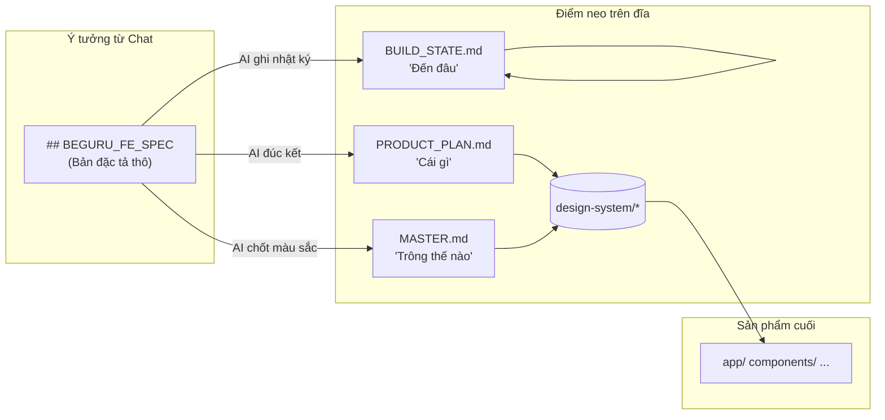
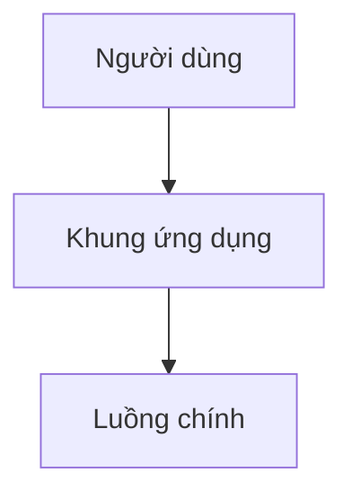

## VI

### Tóm lược

- **BeGuru AI** không chỉ "ném" code vào bạn; nó xây dựng một **nguồn chân lý** bền vững ngay trên đĩa qua thư mục `design-system/` và `.guru/rules/`.
- Hãy tưởng tượng dự án như một con tàu, thì **`PRODUCT_PLAN.md`** là hải trình, **`MASTER.md`** là bảng màu của con tàu, và **`BUILD_STATE.md`** là nhật ký hành trình.
- Mọi thứ được AI đọc và viết theo một **thứ tự nghiêm ngặt**, đảm bảo không có chi tiết nào bị "tam sao thất bản" qua những lần generate.

### Giới thiệu

Bạn đã bao giờ rơi vào tình huống yêu cầu AI viết code, nó làm rất tốt lượt đầu, nhưng đến lượt thứ hai thì nó... quên mất tông màu chủ đạo bạn muốn, hoặc làm sai logic mà hai bên đã thống nhất trước đó? 

Đó là vì AI thường chỉ sống trong "khoảnh khắc" của đoạn chat. Để giải quyết vấn đề này, **BeGuru AI** đã chọn một hướng đi khác: **Neo giữ linh hồn dự án trên đĩa**. Thay vì chỉ dựa vào prompt, mình đã thiết kế để hệ thống ghi lại mọi "thỏa thuận" vào các file Markdown ngay trong repo. 

Trong bài này, mình sẽ cùng bạn khám phá lớp "mặt phẳng thiết kế" — nơi những bản hợp đồng giữa người và máy được ký kết.

### Sợi dây liên kết giữa ý tưởng và mã nguồn

Hãy nhìn vào sơ đồ bên dưới để thấy cách thông tin "chảy" từ những dòng chat của bạn vào đến từng dòng code thực tế:



Ở đây, **SPEC trong chat** là khởi đầu đầy cảm hứng, nhưng **ba file master** mới là những "hợp đồng" giúp AI ghi nhớ và thực thi chính xác trong những lượt generate sau này.

### `MASTER.md` — Khi AI học cách làm Stylist

Bạn không muốn mỗi trang web có một màu xanh khác nhau đúng không? `MASTER.md` chính là nơi mình quy định "luật chơi" về thẩm mỹ. Khi bạn đưa ra một brand guideline trong chat, AI sẽ không chỉ áp dụng một lần rồi thôi, nó sẽ "khắc" những thông số đó vào file này.

```markdown
# Design system master (Guru)

## Suggested default palette (oklch, hue ~252°)

| Token | Light (example) |
|-------|------------------|
| `--primary` | `oklch(0.32 0.12 252)` |
| `--accent` | `oklch(0.94 0.04 252)` |
```

Nhờ có file này, mình có thể kiểm soát được **độ dài ngữ cảnh** (context tokens) mà AI cần đọc, giúp tiết kiệm chi phí mà vẫn đảm bảo tính nhất quán.

### `BUILD_STATE.md` — Nhật ký của một kỹ sư mẫn cán

Làm sao để AI biết nó đã làm xong trang Login chưa, hay trang Dashboard vẫn còn đang lỗi? `BUILD_STATE.md` đóng vai trò như một người quản lý dự án tí hon, luôn cập nhật trạng thái thực tế của repo.

```markdown
# Build state (Guru)

## Current focus (checklist)
- [x] Shell + routing (US:001) - Đã xong
- [ ] Trang Dashboard (US:002) - Đang chờ
```

Mỗi lần AI chuẩn bị viết code mới, nó sẽ liếc nhìn vào đây để biết mình đang đứng ở đâu trong lộ trình tổng thể.

### `PRODUCT_PLAN.md` — Để chúng ta luôn cùng nhìn về một hướng

AI viết cho AI đọc thì dễ, nhưng con người cũng cần hiểu chuyện gì đang xảy ra. `PRODUCT_PLAN.md` là bản tóm tắt dành cho bạn. Nó chứa những sơ đồ Mermaid mô tả luồng nghiệp vụ, giúp bạn nhanh chóng nắm bắt "linh hồn" của sản phẩm mà không cần lội lại hàng trăm dòng chat.



### `.guru/rules` — Bộ luật của "vương quốc" BeGuru

Cuối cùng, để AI không viết code "tùy tiện", mình đã thiết lập một bộ luật nghiêm ngặt trong thư mục `.guru/rules/`. Nó giống như bảng nội quy công ty, bắt buộc AI phải tuân thủ từ cách đặt tên file đến cách xử lý dữ liệu.

```mermaid
flowchart TB
  CORE["bundles/engineer_nextjs/core.md\n(Danh tính AI)"]
  R1[critical-constraints.md\n(Giới hạn tối thượng)]
  R2[mock-auth-and-handoff.md\n(Luật đăng nhập)]
  RN[... closing.md]
  OUT["Lời nhắc hệ thống hoàn chỉnh"]

  CORE --> R1 --> R2 --> RN --> OUT
```

Hệ thống sẽ xếp chồng các quy tắc này lại để tạo ra một "lời nhắc" (prompt) cực kỳ sắc bén cho Engineer Agent.

### Ảnh minh họa — Thử tài Gemini nhé!

Để bài viết thêm sinh động, bạn hãy dùng các prompt này đưa cho Gemini tạo ảnh, rồi gửi lại mình chèn vào nhé:

1. **Prompt ảnh A — “Ba khối trên đĩa”**  
   *“Một minh họa 3D isometric về ba tấm thẻ tài liệu bay phía trên một đĩa cứng máy tính: tiêu đề ‘PRODUCT_PLAN’, ‘MASTER’, ‘BUILD_STATE’, có các mũi tên tinh tế nối giữa chúng, nền gradient xanh dương và tím dịu mắt, phong cách kỹ thuật tối giản.”*

2. **Prompt ảnh B — “Chồng quy tắc”**  
   *“Minh họa phong cách sơ đồ sạch sẽ: một chồng dọc gồm mười hai tấm phẳng mỏng đại diện cho các quy tắc, chảy vào một ống trụ phát sáng duy nhất, thẩm mỹ dành cho lập trình viên, màu sắc thân thiện với chế độ tối.”*

### Hẹn gặp bạn ở phần sau!

Chúng ta đã xong phần "phần xác" của dự án trên đĩa. Ở bài tiếp theo, mình sẽ dẫn bạn đi xem "bộ não" của BeGuru vận hành thế nào với **FastAPI, AgentOS** và cách nó nén những ký ức dài dằng dặc để không bao giờ bị quá tải.

---

## EN

### At a glance

- **BeGuru AI** doesn't just "toss" code at you; it builds a lasting **source of truth** right on your disk via the `design-system/` and `.guru/rules/` directories.
- Think of the project as a ship: **`PRODUCT_PLAN.md`** is the chart, **`MASTER.md`** is the ship's livery, and **`BUILD_STATE.md`** is the captain's log.
- Everything is read and written in a **strict order**, ensuring no details are lost in translation between generation turns.

### Introduction

Have you ever asked an AI to write code, and it did great the first time, but by the second turn, it... forgot your primary colors or messed up the logic you both agreed on?

That's because AI often lives only in the "moment" of the chat. To solve this, **BeGuru AI** took a different path: **Anchoring the project's soul on disk**. Instead of relying solely on prompts, I designed the system to record every "agreement" into Markdown files right in the repo.

In this post, we'll explore the "design plane" — where the contracts between human and machine are signed.

### The Link Between Ideas and Source Code

Take a look at the diagram below to see how information "flows" from your chat messages into the actual lines of code:

(Mermaid diagram same as above)

Here, the **Chat SPEC** is the inspired beginning, but the **three master files** are the "contracts" that help the AI remember and execute accurately in future turns.

### `MASTER.md` — When AI Learns to be a Stylist

You don't want every page of your website to have a different shade of blue, do you? `MASTER.md` is where we define the "rules of play" for aesthetics.

### `BUILD_STATE.md` — The Log of a Diligent Engineer

How does the AI know if it's finished the Login page or if the Dashboard is still buggy? `BUILD_STATE.md` acts as a tiny project manager, always updating the actual state of the repo.

### `PRODUCT_PLAN.md` — So We Always Look in the Same Direction

`PRODUCT_PLAN.md` is the summary for you. It contains Mermaid diagrams describing the business flow, helping you quickly grasp the "soul" of the product without wading through hundreds of chat lines.

### `.guru/rules` — The Laws of the BeGuru Kingdom

Finally, to prevent the AI from writing "random" code, I've established a strict set of laws in the `.guru/rules/` directory. It's like a company handbook, forcing the AI to comply with everything from file naming to data handling.

### Next in the Series

We've covered the "body" of the project on disk. In the next post, I'll show you how BeGuru's "brain" operates with **FastAPI, AgentOS**, and how it compresses long memories to never get overwhelmed.
