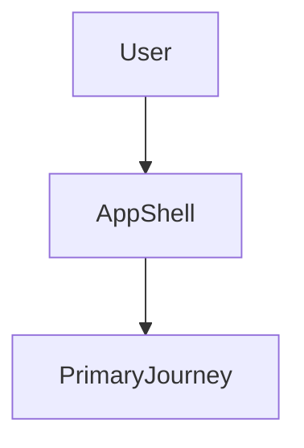
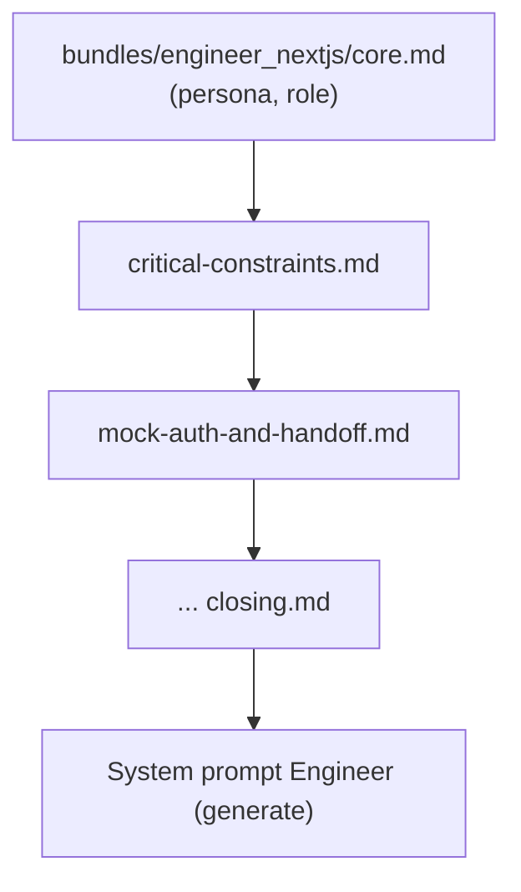
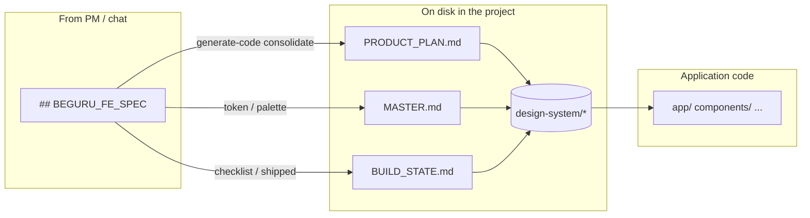
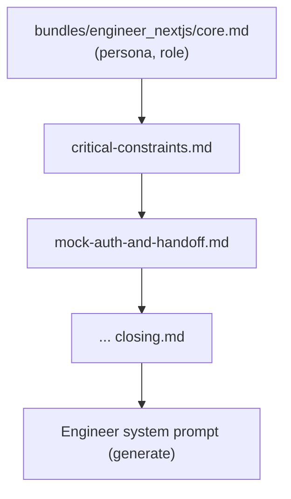

## VI

### Tóm lược

- Trong **BeGuru AI**, “design system” không chỉ là component UI: nó được **neo bằng file** dưới `design-system/` và **rule** dưới `.guru/rules/` để Engineer (model) và người vận hành cùng một **nguồn chân lý**.
- Ba trụ: **`PRODUCT_PLAN.md`** (scope người đọc), **`MASTER.md`** (token / hướng UI), **`BUILD_STATE.md`** (đã ship / checklist / blocker).
- Prompt generate của Engineer **nối** các file này theo thứ tự cố định trong repo `beguru-ai` (template Next.js).

### Giới thiệu

**BeGuru AI** là dịch vụ multi-agent (PM, Architect, Engineer, …) gắn với runtime FastAPI và template sinh mã. Bài này là **Phần 1** trong chuỗi case study: tập trung vào **mặt phẳng thiết kế** — những gì được ghi **trên đĩa** trong project sinh ra, để bài sau có thể nói tới memory, context pack và pipeline mà không bị “trôi” khỏi thực tế repo.

### Quan hệ giữa các artifact (sơ đồ)


Ý chính: **SPEC trong chat** là đầu vào; **ba file master** là “hợp đồng” đọc lại được giữa các lượt generate và giữa người và agent.

### `MASTER.md` — token và hướng UI

File mẫu trong template Next.js định nghĩa palette gợi ý (oklch) và nhắc merge từ spec. Trích đoạn **từ source** (rút gọn comment):

```markdown
# Design system master (Guru)

Các file trong `design-system/` (`PRODUCT_PLAN.md`, `BUILD_STATE.md`, `MASTER.md`) được Engineer (AI) và/hoặc server cập nhật trong quá trình **generate-code** theo spec PM — giữ đồng bộ với scope và token.

## Suggested default palette (oklch, hue ~252°)

| Token | Light (example) |
|-------|------------------|
| `--primary` | `oklch(0.32 0.12 252)` |
| `--accent` | `oklch(0.94 0.04 252)` |
| `--ring` | `oklch(0.52 0.14 252)` |
```

Điểm đáng viết case study kèm **số liệu**: sau khi brand thật vào từ `BEGURU_FE_SPEC`, bạn có thể log **độ dài file** / **số token ước lượng** đưa vào context pack (so với default) — phù hợp bài sau về memory.

### `BUILD_STATE.md` — shipped, checklist, blocker

Đây là **một** chỗ cho tiến độ implementation + checklist slice + bug — tránh tách rời “plan chạy” khỏi code. Đầu file trong template:

```markdown
# Build state (Guru)

**Source of truth** cho (1) **code đã ship / chưa build / bug** trong repo và (2) **checklist slice + focus + blockers** [...]

## Current focus (checklist)

- [ ] Một dòng — slice / story ưu tiên (**US:xxx**)

## Frontend — feature checklist

- [ ] Ví dụ: Shell + routing (US:001)
```

### `PRODUCT_PLAN.md` — scope cho người đọc

Không thay thế block `## BEGURU_FE_SPEC` trong chat, nhưng **tóm cùng ý** trong repo; trong template có section **`## High-level flow (Mermaid)`** — bên dưới là ví dụ placeholder (trong project thật bạn thay bằng luồng nghiệp vụ của khách):



### `.guru/rules` — rule cho IDE và cho prompt Engineer

Các file `.md` trong `templates/guru-nextjs-template/.guru/rules/` là **SSOT** cho luật chi tiết Next.js; API bundle chúng theo **thứ tự cố định** sau `engineer_nextjs/core.md`. Đoạn **từ README** trong repo:

```markdown
## File order (generate prompt)

After `core.md`, concatenate in this order:

1. `critical-constraints.md`
2. `mock-auth-and-handoff.md`
3. `nextjs-app-router.md`
[...]
12. `closing.md`

`README.md` is **not** included in the model prompt.
```

Sơ đồ khái niệm “rule stack”:



### Ảnh minh họa — prompt cho Gemini (bạn tạo rồi chèn vào bài)

Dùng các prompt sau trong **Gemini** (hoặc công cụ ảnh khác), xuất **PNG/WebP** ngang 16:9 hoặc 3:2, phong cách **sạch, kỹ thuật, ít chữ trên ảnh**. Sau khi có file, thêm vào repo blog (ví dụ `public/blog/beguru-design-system-01.png`) và chèn `` tại các mục tương ứng.

1. **Prompt ảnh A — “Ba khối trên đĩa”**  
   *English for image model:* “Isometric 3D illustration of three labeled document cards floating above a hard disk platter: titles ‘PRODUCT_PLAN’, ‘MASTER’, ‘BUILD_STATE’, subtle arrows between them, soft blue and indigo gradient background, minimal text, technical blog hero image, no logos.”

2. **Prompt ảnh B — “Rule stack”**  
   *English:* “Clean diagram-style illustration: a vertical stack of twelve thin plates labeled abstractly as rules flowing into a single glowing output cylinder, developer aesthetic, dark mode friendly, no readable words except stylized labels R1–R12, flat design.”

3. **Prompt ảnh C — “Handoff chat → repo”**  
   *English:* “Split scene: left side a chat bubble silhouette with a small ‘spec’ icon, right side a folder tree with ‘design-system’ folder highlighted, dashed arrow across the middle, modern UI illustration, light background.”

### Kết nối bài sau

Bài tiếp theo trong chuỗi sẽ lên **runtime** (FastAPI, AgentOS, OpenRouter) và **tầng memory/context** — nơi các excerpt từ `MASTER` / `BUILD_STATE` được đo bằng **char cap** và đi vào prompt như thế nào (tham chiếu `MEMORY_AND_CONTEXT_LAYERS.md` trong repo `beguru-ai`).

---

## EN

### At a glance

- In **BeGuru AI**, the design system is not “prompt-only”: it is **materialized as files** under `design-system/` and **rules** under `.guru/rules/`, shared by the Engineer model and operators.
- Three pillars: **`PRODUCT_PLAN.md`** (human-readable scope), **`MASTER.md`** (tokens / UI direction), **`BUILD_STATE.md`** (shipped vs checklist vs blockers).
- The Next.js template in the `beguru-ai` repository wires these into the generate prompt in a **fixed order**.

### Introduction

**BeGuru AI** is a multi-agent coding service (PM, Architect, Engineer, …) backed by a FastAPI runtime and code-generation templates. This is **Part 1** of a case-study series: the **design plane** — what lands **on disk** in a generated project — so later posts on memory, context packs, and pipelines stay grounded in the real repo.

### How the artifacts relate (diagram)

(Same `mermaid` flowchart as in the Vietnamese section — the diagram is language-neutral.)



### `MASTER.md` — tokens and UI direction

The template’s master file anchors suggested **oklch** palette rows and merge behavior. Excerpt (abbreviated from source):

```markdown
# Design system master (Guru)

Các file trong `design-system/` (`PRODUCT_PLAN.md`, `BUILD_STATE.md`, `MASTER.md`) được Engineer (AI) và/hoặc server cập nhật [...]

## Suggested default palette (oklch, hue ~252°)

| Token | Light (example) |
|-------|------------------|
| `--primary` | `oklch(0.32 0.12 252)` |
```

For a metrics-heavy follow-up: compare **file size / estimated tokens** before vs after real brand values from `BEGURU_FE_SPEC`.

### `BUILD_STATE.md` — shipped, checklist, blockers

Single place for implementation progress, slice checklist, and bugs. Opening of the template file:

```markdown
# Build state (Guru)

**Source of truth** cho (1) **code đã ship / chưa build / bug** [...]

## Current focus (checklist)

- [ ] Một dòng — slice / story ưu tiên (**US:xxx**)
```

### `PRODUCT_PLAN.md` — scope for readers

Mirrors agreed scope; the template includes **`## High-level flow (Mermaid)`** with a placeholder diagram — replace with your real product journey:


### `.guru/rules` — rules for IDE and for the Engineer prompt

Markdown files under `templates/guru-nextjs-template/.guru/rules/` are the **SSOT** for detailed Next.js rules; the API concatenates them in a **fixed order** after `engineer_nextjs/core.md`. From the repo README:

```markdown
## File order (generate prompt)

After `core.md`, concatenate in this order:

1. `critical-constraints.md`
2. `mock-auth-and-handoff.md`
3. `nextjs-app-router.md`
[...]
12. `closing.md`

`README.md` is **not** included in the model prompt.
```

Conceptual “rule stack” diagram:



### Illustrations — Gemini prompts (you export, then embed)

Use the same three prompts as in the Vietnamese section; they are written in **English** for image models. After generation, add files under your site’s `public/` folder and reference them with markdown images, e.g. ``.

### Next in the series

The next post will cover **runtime** (FastAPI, AgentOS, OpenRouter) and the **memory / context layers** where `MASTER` / `BUILD_STATE` excerpts are capped and injected into prompts (see `MEMORY_AND_CONTEXT_LAYERS.md` in the `beguru-ai` repository).
