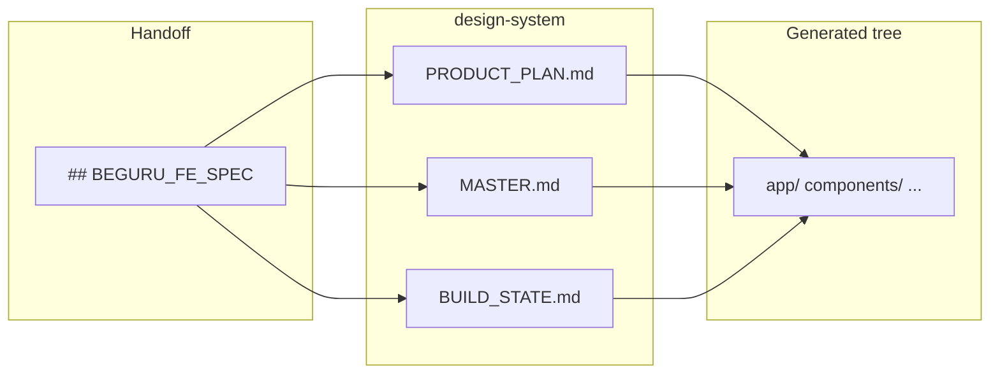

> **Chuỗi BeGuru — Technical Docs**  
> [0. Tổng quan](/blog/beguru-ai-architecture-overview) · [1. Design & đĩa](/blog/beguru-ai-case-study-design-system-disk) · [2. Runtime](/blog/beguru-ai-case-study-runtime-fastapi-agentos) · [3. Memory & context](/blog/beguru-ai-case-study-memory-context-layers) · [4. Mem0 & cross-session](/blog/beguru-ai-mem0-integration-architecture) · [5. Technical Narrative](/blog/beguru-ai-technical-narrative)

## VI

### Tóm lược

- Dưới mỗi project FE sinh ra, thư mục **`design-system/`** là nơi **ghi SSOT** cho token/thiết kế (**`MASTER.md`**), tiến độ (**`BUILD_STATE.md`**), phạm vi sản phẩm (**`PRODUCT_PLAN.md`**) và snapshot context (**`beguru_chat_context.json`**).
- **`## BEGURU_FE_SPEC`** trong chat được Engineer dùng để đồng bộ với các file trên; thứ tự rails ghim cho PM (sau nén) gồm FE spec → BUILD_STATE → MASTER → … — chi tiết trong `beguru-ai/docs/MEMORY_AND_CONTEXT_LAYERS.md`.
- Quy ước **`output_path`**: segment đầu **`frontend_<slug>`** (React/Next) và **`backend_<slug>`** (Go) dưới `projects_root_dir`; không tự do đặt tên lệch quy ước nếu dùng pipeline chuẩn — xem `API_SPEC.md`.

### Mục đích và phạm vi

Bài mô tả **artifact trên đĩa** mà Engineer đọc/ghi và cách chúng liên kết với handoff PM, không mô tả toàn bộ API (xem `API_SPEC.md`).

:::info[Quy ước đường dẫn]
`output_path` với segment `frontend_*` / `backend_*` là điều kiện để pipeline FE/BE và CROSS_STACK hoạt động đúng — không tự đổi format thư mục nếu chưa đọc `API_SPEC.md`.
:::

### Vị trí file trong cây project

| File / thư mục | Vai trò |
|----------------|---------|
| `design-system/MASTER.md` | Token màu, typography, policy merge (`merge` / `if_missing` / `always`) — nguồn thiết kế rút gọn cho prompt Engineer |
| `design-system/BUILD_STATE.md` | Đã ship, checklist, focus/blockers; excerpt inject vào generate-code khi file tồn tại |
| `design-system/PRODUCT_PLAN.md` | Scope, user story, sơ đồ Mermaid do Engineer tạo/cập nhật |
| `design-system/beguru_chat_context.json` | `user_info`, `kyb_data`, `project_context`, `software_type`, … — merge từ `init-project` / chat |
| `.guru/rules/*.md` | Rule Next.js (template repo): auth mock, App Router, v.v. — load qua bundle engineer |

### Luồng từ spec trong chat xuống đĩa

`beguru_chat_context.json` được cập nhật qua `init-project` / merge từ chat; không vẽ vào sơ đồ trên để tránh nhầm với luồng generate-code.

### `MASTER.md`

Chứa guideline thiết kế (ví dụ bảng token OKLCH). Engineer áp dụng theo policy đã định nghĩa trong pipeline (merge khi cập nhật, tránh drift giữa các lượt generate).

### `BUILD_STATE.md`

- Ghi nhận mức độ hoàn thành theo user story / checklist.
- Khi file đã có, `POST /api/freetext/generate-code` inject excerpt **CURRENT BUILD_STATE**; Engineer trả block cập nhật full-file theo thứ tự quy định trong tài liệu API (code → PRODUCT_PLAN nếu có → BUILD_STATE cuối).

### `PRODUCT_PLAN.md`

Tóm tắt phạm vi đã chốt và có thể kèm **Mermaid** mô tả luồng nghiệp vụ; là nguồn excerpt trong context pack (không thay thế toàn bộ spec trong chat).

### `beguru_chat_context.json`

Cấu trúc tóm tắt (theo contract API): merge shallow với body chat; dùng cho PM pins (`[PINNED_USER_INFO]`, `[PINNED_KYB]`, `[PINNED_PROJECT_CONTEXT]`, …). Có thể có `backend_output_path` trong `project_context` để excerpt **CROSS_STACK** khi khóa BackendSpec.

### `.guru/rules` và bundle Engineer

Template Next.js ship kèm **`.guru/rules/`**; server load thứ tự cố định cùng `bundles/engineer_nextjs/core.md` (xem README trong template và `ARCHITECTURE_RUNTIME.md` mục Engineer Next.js).

### Phụ thuộc đọc thêm

- [Tổng quan kiến trúc](/blog/beguru-ai-architecture-overview) — map hệ thống.
- [Runtime](/blog/beguru-ai-case-study-runtime-fastapi-agentos) — route `generate-code`, `init-project`.
- [Memory & context](/blog/beguru-ai-case-study-memory-context-layers) — thứ tự ghim và context pack.

---

## EN

### At a glance

- For each generated FE project, **`design-system/`** holds **SSOT** files: **`MASTER.md`** (tokens/design), **`BUILD_STATE.md`** (progress), **`PRODUCT_PLAN.md`** (scope), and **`beguru_chat_context.json`** (context snapshot).
- **`## BEGURU_FE_SPEC`** in chat is consumed by the Engineer to align with on-disk files; PM pin rail order after compression (FE spec → BUILD_STATE → MASTER → …) is documented in `beguru-ai/docs/MEMORY_AND_CONTEXT_LAYERS.md`.
- **`output_path`** segments **`frontend_<slug>`** (React/Next) and **`backend_<slug>`** (Go) under `projects_root_dir` are required for the standard pipeline — see `API_SPEC.md`.

### Purpose and scope

This post describes **on-disk artifacts** the Engineer reads/writes and how they relate to PM handoff; it does not replace `API_SPEC.md`.

:::info[Path conventions]
Keep `frontend_*` / `backend_*` leading segments as documented in `API_SPEC.md` so FE/BE pipelines and CROSS_STACK stay consistent.
:::

### File layout

| Path | Role |
|------|------|
| `design-system/MASTER.md` | Color/typography tokens; merge policy (`merge` / `if_missing` / `always`) |
| `design-system/BUILD_STATE.md` | Shipped items, checklist, focus/blockers; excerpt injected into generate-code when the file exists |
| `design-system/PRODUCT_PLAN.md` | Scope, stories, Mermaid diagrams maintained by the Engineer |
| `design-system/beguru_chat_context.json` | `user_info`, `kyb_data`, `project_context`, `software_type`, … — merged from `init-project` / chat |
| `.guru/rules/*.md` | Next.js rules shipped with the template (mock auth, App Router, …) |

### Flow from chat spec to disk

Use the same Mermaid diagram as in the Vietnamese section.

### `MASTER.md`

Holds design guidelines (e.g. OKLCH token tables). The Engineer applies merge policy defined in the pipeline to limit drift across generations.

### `BUILD_STATE.md`

Tracks completion by story/checklist. When the file already exists, `POST /api/freetext/generate-code` injects a **CURRENT BUILD_STATE** excerpt; the Engineer returns full-file updates in the order specified in the API docs.

### `PRODUCT_PLAN.md`

Summarizes agreed scope and may include **Mermaid** business-flow diagrams; excerpts feed the context pack (it does not replace the full chat spec).

### `beguru_chat_context.json`

Structured snapshot (per API contract): shallow merge with chat body; feeds PM pins (`[PINNED_USER_INFO]`, `[PINNED_KYB]`, `[PINNED_PROJECT_CONTEXT]`, …). May include `backend_output_path` in `project_context` for **CROSS_STACK** excerpts when BackendSpec is locked.

### `.guru/rules` and Engineer bundle

The Next.js template ships **`.guru/rules/`**; the server loads a fixed order together with `bundles/engineer_nextjs/core.md` (see template README and `ARCHITECTURE_RUNTIME.md`).

### See also

- [Architecture overview](/blog/beguru-ai-architecture-overview)
- [Runtime](/blog/beguru-ai-case-study-runtime-fastapi-agentos)
- [Memory & context](/blog/beguru-ai-case-study-memory-context-layers)
