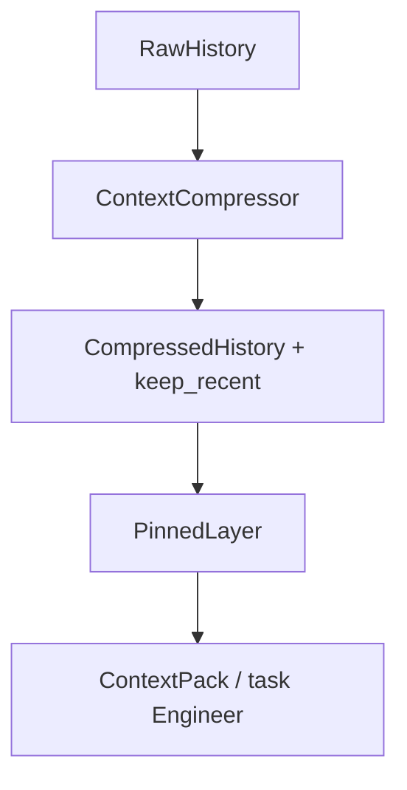

> **Chuỗi BeGuru — Technical Docs**  
> [0. Tổng quan](/blog/beguru-ai-architecture-overview) · [1. Design & đĩa](/blog/beguru-ai-case-study-design-system-disk) · [2. Runtime](/blog/beguru-ai-case-study-runtime-fastapi-agentos) · [3. Memory & context](/blog/beguru-ai-case-study-memory-context-layers) · [4. Mem0 & cross-session](/blog/beguru-ai-mem0-integration-architecture) · [5. Technical Narrative](/blog/beguru-ai-technical-narrative)

## VI

### Tóm lược

- Pipeline khái niệm: **RawHistory** (messages sau enrich) → **CompressedHistory** (nếu vượt ngưỡng) → **PinnedLayer** (ghim sau nén) → **ContextPack** cho Engineer (Next.js: `build_nextjs_context_pack`).
- **Pins** dùng tiền tố ổn định (FE spec, BUILD_STATE, MASTER, USER_INFO, KYB, project context, resource digest) — public internal API; đổi chuỗi phải migrate client/parser (xem `fe_spec.py`, `beguru_chat_context.py` trong repo).
- **Artifact đĩa** (`PRODUCT_PLAN.md`, `BUILD_STATE.md`, `MASTER.md`, `beguru_chat_context.json`, …) là SSOT giữa các lượt — Engineer đọc qua context pack, không cần full chat.
- **DB**: SQLite / SQLAlchemy (`AgentMemory`, `AgentSession`, `WorkflowExecution`); tùy chọn persist bản tóm tắt nén khi bật `FREETEXT_PERSIST_COMPRESSOR_SUMMARY` (hành vi chi tiết trong `MEMORY_AND_CONTEXT_LAYERS.md`).
- **Hướng mở rộng:** `ADR-0002-memory-oss.md` (Mem0 / pgvector / LangGraph) — **hiện không triển khai** tới khi có chứng cứ sản phẩm.

:::expand[ADR-0002 — chi tiết]
File `ADR-0002-memory-oss.md` trong repo mô tả hướng Mem0 / pgvector / LangGraph; **chưa** có trong runtime cho tới khi có chứng cứ sản phẩm (xem `MEMORY_AND_CONTEXT_LAYERS.md` mục cuối).
:::

### Mục đích

Giải thích **contract nội bộ** các tầng memory/context trong runtime `beguru-ai`, không thay thế toàn bộ `MEMORY_AND_CONTEXT_LAYERS.md`.

:::todo[Đối chiếu khi đọc]
- [ ] Xác định version `beguru-ai` bạn đang chạy
- [ ] Mở `MEMORY_AND_CONTEXT_LAYERS.md` trên cùng commit khi cần số chính xác cho env `FREETEXT_*`
:::

### Pipeline tổng quát

1. **RawHistory** — `messages` trong request (sau enrich URL/file).
2. **CompressedHistory** — nếu `len(messages) > freetext_compress_threshold`: các turn cũ → `[CONTEXT_SUMMARY …]`, giữ `keep_recent` turn cuối.
3. **PinnedLayer** — sau compress: message máy ghim cho PM (`build_pm_pinned_machine_messages`); không bị đưa vào bước tóm tắt (prepend sau).
4. **ContextPack** — với Engineer Next.js: spec, excerpt PRODUCT_PLAN, MASTER, BUILD_STATE, CROSS_STACK (tuỳ chọn), digest, task.

### Bốn lớp “bộ nhớ” (ôn tập)

| Lớp | Mô tả ngắn |
|-----|------------|
| Short-term | Turn trong request + cửa sổ sau nén; settings: `freetext_compress_threshold`, `freetext_compress_keep_recent_*` |
| Session structured (pins) | Block có tiền tố cố định; đặt **sau** compress |
| Artifact đĩa | File dưới `design-system/` — nguồn chân lý giữa các lượt build |
| DB | SQLite; optional lưu summary sau nén (vận hành / bước sau) |

### Token, giới hạn đọc file

- Ước lượng token khi nén: log `compress_history`; `FREETEXT_TOKEN_ESTIMATE_MODE`: `chars4` hoặc `tiktoken_cl100k`.
- Trần đọc BUILD_STATE / CROSS_STACK: `freetext_build_state_max_chars`, `freetext_cross_stack_max_chars` (env `FREETEXT_BUILD_STATE_MAX_CHARS`, `FREETEXT_CROSS_STACK_MAX_CHARS`).

### Prompt resolution (Engineer generate)

- `FREETEXT_LOG_PROMPT_RESOLUTION=true`: log metadata manifest (`segments_applied`, độ dài spec/design, …).

### Liên kết bài khác

- Artifact đĩa: [Design system & đĩa](/blog/beguru-ai-case-study-design-system-disk).
- Route chat/generate: [Runtime](/blog/beguru-ai-case-study-runtime-fastapi-agentos).
- Map hệ thống: [Tổng quan](/blog/beguru-ai-architecture-overview).

---

## EN

### At a glance

- Conceptual pipeline: **RawHistory** → **CompressedHistory** (optional) → **PinnedLayer** → **ContextPack** for the Engineer.
- **Pins** use stable prefixes (FE spec, BUILD_STATE, MASTER, USER_INFO, KYB, project context, resource digest) — changing strings requires client/parser migration.
- **On-disk artifacts** under `design-system/` are the SSOT across turns; the Engineer consumes them via the context pack, not full chat history.
- **DB:** SQLite / SQLAlchemy; optional persistence of compressor summaries when `FREETEXT_PERSIST_COMPRESSOR_SUMMARY` is enabled — see `MEMORY_AND_CONTEXT_LAYERS.md` for exact behavior.
- **Future work:** `ADR-0002-memory-oss.md` (Mem0 / pgvector / LangGraph) is **not implemented** until product evidence warrants it.

:::expand[ADR-0002 details]
Repo file `ADR-0002-memory-oss.md` discusses Mem0 / pgvector / LangGraph; **not** in the current runtime until product evidence exists (see end of `MEMORY_AND_CONTEXT_LAYERS.md`).
:::

### Purpose

Explain the **internal contract** for memory/context layers in `beguru-ai`; this post does not replace `MEMORY_AND_CONTEXT_LAYERS.md`.

:::todo[While reading]
- [ ] Confirm which `beguru-ai` version you run
- [ ] Open `MEMORY_AND_CONTEXT_LAYERS.md` at the same commit when you need exact `FREETEXT_*` values
:::

### Pipeline diagram

(Same Mermaid `flowchart TD` as in the Vietnamese section.)

### Four memory layers (summary)

| Layer | Summary |
|-------|---------|
| Short-term | Turns in the request + window after compression; settings: `freetext_compress_threshold`, `freetext_compress_keep_recent_*` |
| Session pins | Stable-prefix blocks; applied **after** compression |
| On-disk artifacts | Files under `design-system/` — SSOT across build turns |
| DB | SQLite; optional persistence of compressor summaries when enabled |

### Token budgets and file read caps

- Token estimation when compressing: logged with `compress_history`; `FREETEXT_TOKEN_ESTIMATE_MODE`: `chars4` or `tiktoken_cl100k`.
- Caps for BUILD_STATE / CROSS_STACK excerpts: `freetext_build_state_max_chars`, `freetext_cross_stack_max_chars` (env `FREETEXT_BUILD_STATE_MAX_CHARS`, `FREETEXT_CROSS_STACK_MAX_CHARS`).

### Prompt resolution logging

- `FREETEXT_LOG_PROMPT_RESOLUTION=true`: logs manifest metadata (`segments_applied`, spec/design lengths, …).

### Related posts

- [Design & disk](/blog/beguru-ai-case-study-design-system-disk)
- [Runtime](/blog/beguru-ai-case-study-runtime-fastapi-agentos)
- [Architecture overview](/blog/beguru-ai-architecture-overview)
