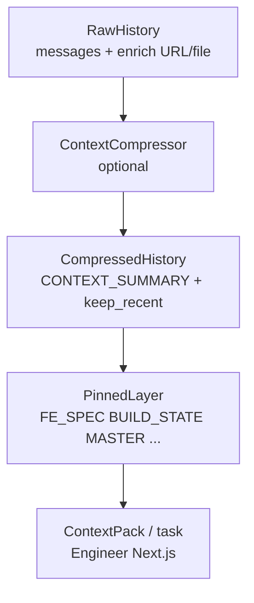
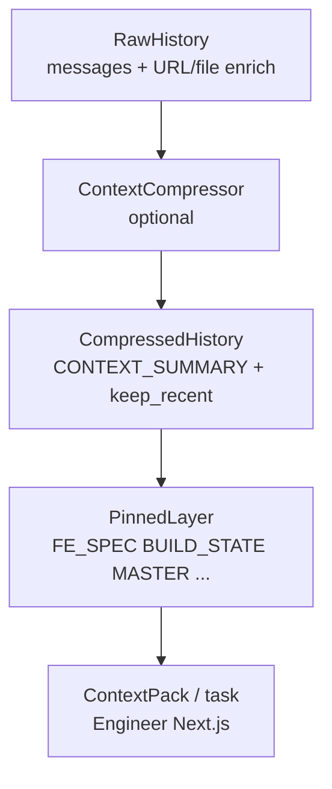

## VI

### Tóm lược

- PM chat và **generate-code** dùng chung **`ContextCompressor`**: quá ngưỡng thì turn cũ gom vào **`[CONTEXT_SUMMARY …]`**, giữ **`keep_recent`** turn gần nhất.
- **Pins** (sau nén): FE spec đã consolidate, **BUILD_STATE**, **MASTER**, **USER_INFO** / **KYB** / **project_context**, **RESOURCE_DIGEST** — định nghĩa ổn định trong code (`PINNED_BLOCK_PREFIXES`); đổi format là **breaking** cho client/parser.
- **Context pack** Engineer (Next.js) gom spec, excerpt **PRODUCT_PLAN** / **MASTER** / **BUILD_STATE**, digest, task; **BUILD_STATE** đã tồn tại thì server inject excerpt (**CURRENT BUILD_STATE**) trong `generate-code`.
- Giới hạn đọc: **`freetext_build_state_max_chars`**, **`freetext_cross_stack_max_chars`**; ước token: `FREETEXT_TOKEN_ESTIMATE_MODE` (`chars4` vs `tiktoken_cl100k`). DB **SQLite** + tùy chọn persist summary — roadmap mở rộng xem **ADR-0002** (Mem0/pgvector/LangGraph) **chưa triển khai**.

### Giới thiệu

**Phần 3** đóng vòng “dữ liệu đi vào model”: sau khi đã có **runtime** (Phần 2) và **file thiết kế** (Phần 1), bài này mô tả **contract nội bộ** các tầng nhớ trong RunPlane — trích và tóm tắt từ `MEMORY_AND_CONTEXT_LAYERS.md`.

### Pipeline khái niệm

### Bốn “tầng” bộ nhớ (rút gọn)

1. **Short-term** — turn trong request + cửa sổ sau nén. Settings ví dụ: `freetext_compress_threshold`, `freetext_compress_keep_recent_chat`, `freetext_compress_keep_recent_generate`.

2. **Session structured (pins)** — block máy ghim **sau** compress để không bị tóm tắt nuốt mất. Ví dụ nhóm chức năng (không liệt kê đủ constant): FE spec, **BUILD_STATE**, **MASTER**, user/KYB/project snapshot, digest tài nguyên.

3. **Artifact trên đĩa** — `PRODUCT_PLAN.md`, `BUILD_STATE.md`, `MASTER.md`, `beguru_chat_context.json`, spec backend… Engineer đọc qua context pack; **ghi file theo thứ tự khối stream** (code → `PRODUCT_PLAN` nếu có → `BUILD_STATE` cuối) — không reorder phía server.

4. **DB** — `AgentMemory`, `AgentSession`, `WorkflowExecution`. Tùy chọn: `FREETEXT_PERSIST_COMPRESSOR_SUMMARY=true` ghi `[CONTEXT_SUMMARY]` sau nén; **không** tự prepend lại request trong phiên bản hiện tại.

### Ước token, cap, log

Trích ý từ tài liệu (để bạn điền số thật khi làm case study):

- `ContextCompressor` log `compress_history` với `estimated_tokens_older_input` / `estimated_tokens_summary_output`.
- Cap đọc BUILD_STATE / excerpt cross-stack BE: env **`FREETEXT_BUILD_STATE_MAX_CHARS`**, **`FREETEXT_CROSS_STACK_MAX_CHARS`** (excerpt BE không nhét full OpenAPI).
- `FREETEXT_LOG_PROMPT_RESOLUTION=true` → log metadata manifest engineer (`segments_applied`, độ dài spec/design, …).

### PM / Engineer (một hook sản phẩm)

- **BUILD SCOPE GATE:** PM có thể tách **PM:mvp** (hỏi build full MVP hay từng US) rồi mới handoff `## BEGURU_FE_SPEC` + nút Build — **không đổi API**, chỉ protocol hội thoại.
- Engineer **generate-code** compose theo manifest `engineer_nextjs_generate.json` (core → ui_ux lead → … → FE spec → design → ui_ux trailer); **edit-code** dùng `edit_core.md` + `ui_ux_quality` (+ premium nếu bật).

### Roadmap memory nâng cao

**ADR-0002** (Mem0 / pgvector / LangGraph): **chưa làm** cho tới khi có chứng cứ sản phẩm — phù hợp đoạn “lessons learned” trong case study.

### Ảnh minh họa — prompt cho Gemini

1. **Tầng giống sandwich** — *English:* “Cross-section diagram: four horizontal layers labeled from bottom to top ‘Disk artifacts’, ‘DB optional’, ‘Pins’, ‘Compressed history’, with thin arrows upward; soft blue-gray palette, editorial infographic style, no text except layer labels.”
2. **Funnel token** — *English:* “Wide funnel at top labeled ‘raw messages’ narrowing through a gear icon ‘compress’ into a narrow pipe ‘context pack to model’; abstract flat vector, minimal.”

### Nối bài sau

Phần 4 có thể đi sâu **edit-code**, **Next.js static check**, và **quan sát** (Sprint 2 trong `ARCHITECTURE_RUNTIME.md`) — gợi ý chứ chưa viết ở đây.

---

## EN

### At a glance

- PM chat and **generate-code** share **`ContextCompressor`**: beyond a threshold, older turns collapse into **`[CONTEXT_SUMMARY …]`**, keeping **`keep_recent`** turns verbatim.
- **Pins** (after compression): consolidated FE spec, **BUILD_STATE**, **MASTER**, **USER_INFO** / **KYB** / **project_context**, **RESOURCE_DIGEST** — stable prefixes in code (`PINNED_BLOCK_PREFIXES`); changing formats is a **breaking** change for clients/parsers.
- The Engineer **context pack** (Next.js) bundles spec, **PRODUCT_PLAN** / **MASTER** / **BUILD_STATE** excerpts, digest, task; if **BUILD_STATE** already exists, **`generate-code`** injects an excerpt (**CURRENT BUILD_STATE**).
- Read caps: **`freetext_build_state_max_chars`**, **`freetext_cross_stack_max_chars`**; token estimate: `FREETEXT_TOKEN_ESTIMATE_MODE`. **SQLite** DB + optional summary persistence — future work in **ADR-0002** (Mem0/pgvector/LangGraph) **not implemented** yet.

### Introduction

**Part 3** closes the loop on “what the model sees.” After **runtime** (Part 2) and **design files** (Part 1), this post summarizes the **internal memory contract** for RunPlane — condensed from `MEMORY_AND_CONTEXT_LAYERS.md`.

### Conceptual pipeline

### Four memory layers (abbreviated)

1. **Short-term** — in-request turns + post-compression window. Example settings: `freetext_compress_threshold`, `freetext_compress_keep_recent_chat`, `freetext_compress_keep_recent_generate`.

2. **Session structured (pins)** — machine blocks **after** compression so summaries do not erase them.

3. **On-disk artifacts** — `PRODUCT_PLAN.md`, `BUILD_STATE.md`, `MASTER.md`, `beguru_chat_context.json`, backend specs… read via context pack; **write order follows streamed blocks** (see internal API docs).

4. **DB** — `AgentMemory`, `AgentSession`, `WorkflowExecution`. Optional: persist `[CONTEXT_SUMMARY]` when `FREETEXT_PERSIST_COMPRESSOR_SUMMARY=true`; **not** auto-prepended to requests in the current version.

### Token estimate, caps, logs

- `ContextCompressor` logs `estimated_tokens_older_input` / `estimated_tokens_summary_output` on `compress_history`.
- BUILD_STATE read / cross-stack BE excerpt caps via **`FREETEXT_BUILD_STATE_MAX_CHARS`**, **`FREETEXT_CROSS_STACK_MAX_CHARS`**.
- `FREETEXT_LOG_PROMPT_RESOLUTION=true` logs engineer manifest metadata.

### PM / Engineer product hooks

- **BUILD SCOPE GATE** in conversation before `## BEGURU_FE_SPEC` handoff (no API change).
- **generate-code** composition follows `engineer_nextjs_generate.json`; **edit-code** uses `edit_core.md` + `ui_ux_quality`.

### Advanced memory roadmap

See **ADR-0002** — deferred until product evidence warrants it.

### Illustrations — Gemini prompts

Same two English prompts as in the Vietnamese section; save under `public/blog/` and embed.

### Next post

Part 4 can cover **edit-code**, **Next.js static check**, and **observability** (Sprint 2 in `ARCHITECTURE_RUNTIME.md`).
