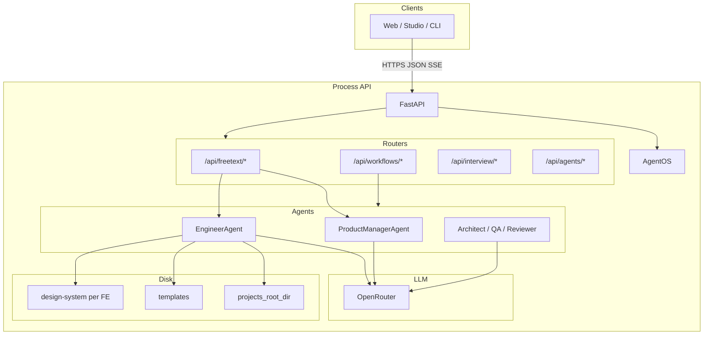
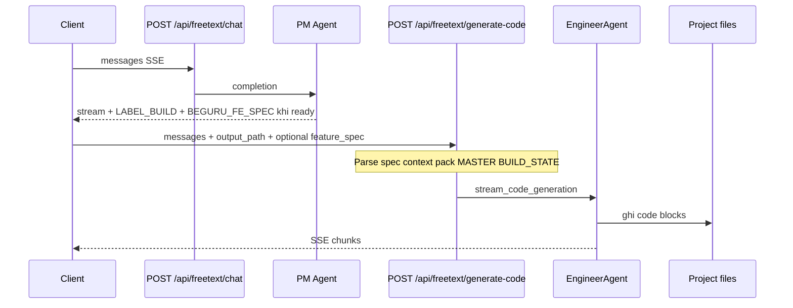
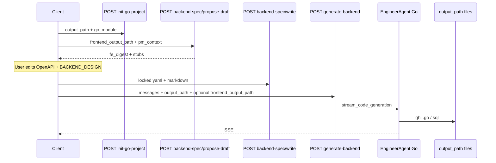

> **Chuỗi BeGuru — Technical Docs**  
> [0. Tổng quan](/blog/beguru-ai-architecture-overview) · [1. Design & đĩa](/blog/beguru-ai-case-study-design-system-disk) · [2. Runtime](/blog/beguru-ai-case-study-runtime-fastapi-agentos) · [3. Memory & context](/blog/beguru-ai-case-study-memory-context-layers) · [4. Mem0 & cross-session](/blog/beguru-ai-mem0-integration-architecture)

## VI

### Tóm lược

- **FastAPI** (`src.api.main`) là HTTP server: CORS, middleware logging, `/health`; các router **`freetext`**, **`workflows`**, **`interview`**, **`agents`** được include vào app.
- **AgentOS (Agno)** giữ registry agent; **ProductManagerAgent** và **EngineerAgent** (và các vai trò khác) gọi LLM qua **OpenRouter** (`OpenRouterModel`, attribution header mặc định theo docs).
- Luồng FE: **`POST /api/freetext/chat`** (SSE) → PM; **`POST /api/freetext/generate-code`** → Engineer ghi file dưới `output_path`. Luồng BE Go: **`init-go-project`**, **`backend-spec/*`**, **`generate-backend`** — có gate khóa spec trước khi sinh code.

### Mục đích

Mô tả **kiến trúc đang chạy** của service `beguru-ai` ở mức triển khai; chi tiết request/response nằm trong `docs/API_SPEC.md`.

:::tip[Triển khai]
Port systemd và biến `.env` trên VPS có thể khác máy dev — xem `ARCHITECTURE_RUNTIME.md` § deploy và script `deploy_to_server.sh`.
:::

### Sơ đồ tổng quan

### Luồng chính: chat PM → generate-code (Next.js)

### Luồng Go backend (tóm tắt)

Sau khi FE tồn tại, pipeline gồm khởi tạo module Go, dự thảo/ khóa **BackendSpec**, rồi **`generate-backend`**. **Source of truth** codegen: `docs/backend-spec-*.yaml` + `docs/BACKEND_DESIGN.md` sau bước write; có tích hợp excerpt FE ↔ BE qua `frontend_output_path` / `backend_output_path` — đủ chi tiết trong `ARCHITECTURE_RUNTIME.md` §2b.

### Bảng thành phần (rút gọn)

| Thành phần | Vai trò |
|------------|---------|
| FastAPI | HTTP, health, include routers |
| AgentOS | Registry / vòng đời agent |
| Settings | `.env` → `projects_root_dir`, model ids, ngưỡng freetext, … |
| OpenRouter | Gateway model; header attribution |
| Templates | `guru-nextjs-template`, `beguru-go-template-be` |
| StructuredLogger | Giới hạn độ dài log, preview LLM (Sprint 2) |
| Next static check | `run_nextjs_static_check` sau generate/edit (tuỳ cấu hình) |

### Triển khai điển hình

- Chạy: `python scripts/run_agentos.py` (uvicorn), thường **systemd** unit `beguru-ai`.
- Port: ví dụ `8089` (remote `.env`).
- Sync: `rsync` từ máy dev — xem `scripts/deploy_to_server.sh`.

### Tham chiếu

- Repo `beguru-ai`: `docs/ARCHITECTURE_RUNTIME.md`, `docs/API_SPEC.md`.
- [Tổng quan](/blog/beguru-ai-architecture-overview) · [Design & đĩa](/blog/beguru-ai-case-study-design-system-disk) · [Memory](/blog/beguru-ai-case-study-memory-context-layers).

---

## EN

### At a glance

- **FastAPI** hosts the HTTP API with routers for **`freetext`**, **`workflows`**, **`interview`**, and **`agents`**.
- **AgentOS (Agno)** registers **PM** and **Engineer** agents; LLM calls go through **OpenRouter** with standard attribution headers.
- **FE path:** `POST /api/freetext/chat` → PM; `POST /api/freetext/generate-code` → Engineer writes under `output_path`. **BE path:** `init-go-project` → `backend-spec/*` → `generate-backend` with a lock step before codegen.

### Purpose

Describe the **running architecture** of `beguru-ai`; request/response details live in `docs/API_SPEC.md`.

:::tip[Deployment]
Ports, systemd unit name, and remote `.env` may differ from your laptop — see `ARCHITECTURE_RUNTIME.md` (deployment) and `scripts/deploy_to_server.sh`.
:::

### Overview and sequence diagrams

Use the same Mermaid **flowchart TB** and **sequenceDiagram** blocks as in the Vietnamese section above.

### Component table (abbreviated)

| Piece | Role |
|-------|------|
| FastAPI | HTTP, health, router includes |
| AgentOS | Agent registry / lifecycle |
| Settings | `.env` → `projects_root_dir`, model ids, freetext thresholds, … |
| OpenRouter | Model gateway; attribution headers |
| Templates | `guru-nextjs-template`, `beguru-go-template-be` |
| StructuredLogger | Log size caps, LLM previews (Sprint 2) |
| Next static check | `run_nextjs_static_check` after generate/edit (config-dependent) |

### Typical deployment

- Run `python scripts/run_agentos.py` (uvicorn), often under **systemd** `beguru-ai`.
- Example port `8089` (remote `.env`).
- Deploy sync: `rsync` from dev — see `scripts/deploy_to_server.sh`.

### References

- `beguru-ai` repo: `docs/ARCHITECTURE_RUNTIME.md`, `docs/API_SPEC.md`.
- [Overview](/blog/beguru-ai-architecture-overview) · [Design & disk](/blog/beguru-ai-case-study-design-system-disk) · [Memory](/blog/beguru-ai-case-study-memory-context-layers).
