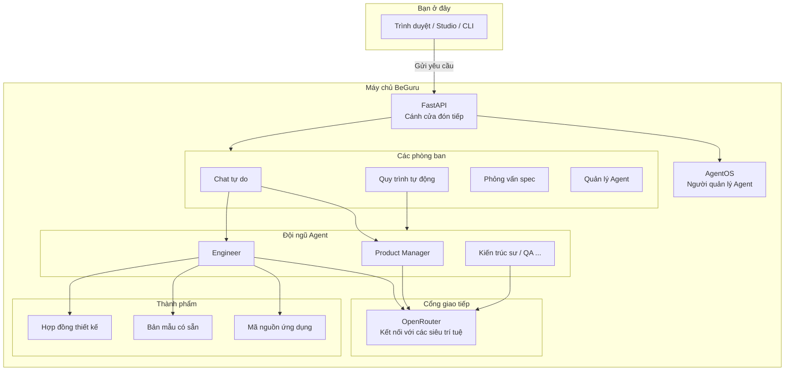
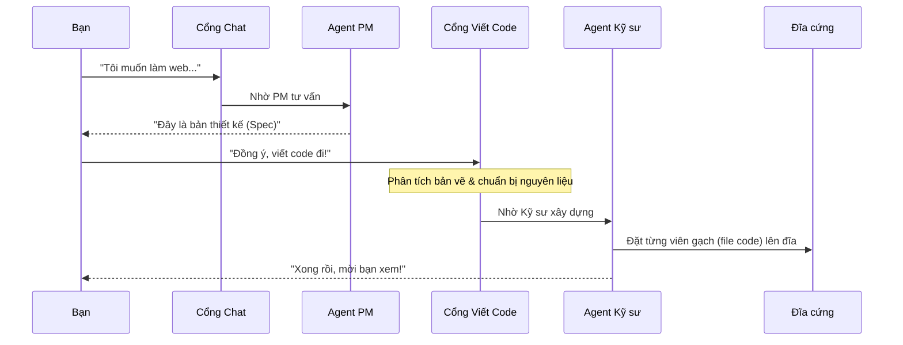
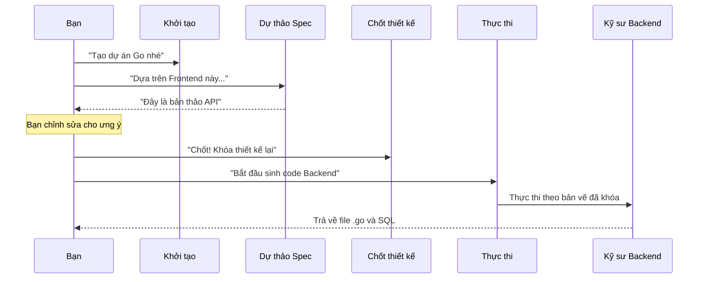

## VI

### Tóm lược

- Hãy coi **FastAPI** là cánh cửa đón khách, và các **Routers** là những biển chỉ dẫn đưa yêu cầu của bạn đến đúng phòng ban (`freetext`, `workflows`, ...).
- **AgentOS (Agno)** giống như một người quản lý nhân sự, điều phối các Agent chuyên trách (PM, Engineer) phối hợp nhịp nhàng với nhau.
- Mọi Agent đều giao tiếp với thế giới bên ngoài qua **OpenRouter** và cuối cùng "đúc" kết quả thành các file thực tế trên đĩa cứng của bạn.

### Giới thiệu

Khi bạn gõ một dòng yêu cầu "Tạo cho tôi trang đăng nhập đẹp mắt", điều gì thực sự xảy ra đằng sau màn hình? Liệu có phải chỉ là một cú gọi API đơn giản đến ChatGPT? 

Thực tế phức tạp và thú vị hơn nhiều. Để xây dựng được một hệ thống có thể tự viết code, mình phải tạo ra một "nhà máy" vận hành liên tục. Trong bài này, mình sẽ dẫn bạn đi tham quan "nhà máy" **BeGuru AI** — nơi FastAPI làm nền móng và AgentOS đóng vai trò bộ não điều khiển.

### Sơ đồ tổng quan: Bản đồ nhà máy BeGuru

Dưới đây là cách các thành phần trong hệ thống kết nối với nhau. Đừng để các thuật ngữ làm bạn rối, hãy coi mỗi khối là một trạm trong dây chuyền sản xuất:

### Hành trình của một dòng code

Hãy cùng theo chân một yêu cầu tạo Frontend (React/Next.js). Đây là một chuỗi các sự kiện diễn ra nối tiếp nhau:

**Một chút số liệu thú vị:** Trong thực tế, một lượt `generate-code` có thể mất từ 30 giây đến vài phút tùy vào độ phức tạp. Hệ thống sẽ trả về từng "mảnh" code (chunk) ngay khi nó vừa được viết ra để bạn không phải chờ đợi trong vô vọng.

### Khi BeGuru học cách viết Backend (Go)

Không chỉ dừng lại ở giao diện, BeGuru còn có một quy trình nghiêm ngặt cho Backend. Điểm mấu chốt ở đây là các "cổng kiểm soát" (gate) để đảm bảo Backend và Frontend luôn khớp nhau qua các Segments như `frontend_<slug>` và `backend_<slug>`.

### Những "người hùng" thầm lặng

| Thành phần | Công việc của họ |
|------------|---------|
| **FastAPI** | Tiếp nhận yêu cầu, kiểm tra an ninh và ghi nhật ký. |
| **AgentOS** | Nơi lưu trữ danh sách các Agent và giúp chúng phối hợp. |
| **OpenRouter** | Giúp BeGuru có thể nói chuyện với bất kỳ Model AI nào (GPT-4, Claude, Gemini...). |
| **Disk** | Nơi lưu giữ thành quả cuối cùng — những dòng code bạn có thể chạy được. |

### Ảnh minh họa — Thử tài Gemini nhé!

1. **Hero “Hệ thống router”** — *“Một minh họa 3D isometric về tủ rack máy chủ với một cổng phát sáng ghi chữ ‘API’ chia thành bốn đường ống labeled ‘freetext’, ‘workflows’, ‘agents’, ‘interview’, minh họa công nghệ sạch sẽ, nền gradient xanh dương-tím.”*
2. **Minh họa “Dây chuyền sản xuất”** — *“Hai làn đường song song: làn trên ‘Chat PM’ với các bóng thoại chảy vào biểu tượng tài liệu; làn dưới ‘Viết code’ với biểu tượng file hạ cánh xuống chồng đĩa cứng; có đường nét đứt nối giữa hai làn; tối giản.”*

### Hẹn gặp bạn ở phần sau!

Chúng ta đã biết yêu cầu đi đâu và về đâu. Nhưng làm sao AI có thể nhớ được những gì bạn đã nói từ 10 phút trước mà không bị "lú"? Câu trả lời nằm ở **Phần 3: Memory & Context** — nơi mình sẽ bật mí cách BeGuru nén những ký ức khổng lồ thành những mẩu tin nhỏ gọn.

---

## EN

### At a glance

- Think of **FastAPI** as the welcoming door, and **Routers** as the signs guiding your requests to the right departments (`freetext`, `workflows`, etc.).
- **AgentOS (Agno)** acts like an HR manager, coordinating specialized Agents (PM, Engineer) to work together seamlessly.
- Every Agent communicates with the outside world through **OpenRouter** and finally "forges" the results into actual files on your hard drive.

### Introduction

When you type "Build me a beautiful login page," what really happens behind the screen? Is it just a simple API call to ChatGPT?

In reality, it's much more complex and exciting. To build a system that can write its own code, I had to create a "factory" that runs non-stop. In this post, I'll take you on a tour of the **BeGuru AI** factory — where FastAPI provides the foundation and AgentOS acts as the controlling brain.

### Overview Diagram: The BeGuru Factory Map

(Same `mermaid` figure as in the Vietnamese section.)

### The Journey of a Line of Code

(Same `mermaid` sequence diagram as in the Vietnamese section.)

**Cool fact:** In practice, a `generate-code` turn can take anywhere from 30 seconds to several minutes depending on complexity. The system streams back "chunks" of code as they are written so you aren't left waiting in the dark.

### When BeGuru Learns to Write Backend (Go)

(Same `mermaid` sequence diagram as in the Vietnamese section.)

### The Silent Heroes

| Piece | Role |
|-------|------|
| **FastAPI** | Handles requests, security checks, and logging. |
| **AgentOS** | The registry where Agents live and coordinate. |
| **OpenRouter** | Gives BeGuru a voice through any AI model (GPT-4, Claude, Gemini...). |
| **Disk** | Where the final product lives — code you can actually run. |

### Next in the Series

We now know where requests come and go. But how does the AI remember what you said 10 minutes ago without getting "confused"? The answer lies in **Part 3: Memory & Context** — where I'll reveal how BeGuru compresses massive memories into compact snippets.
