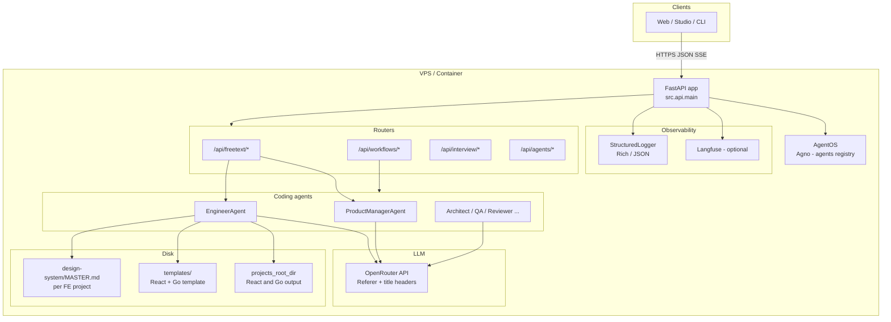
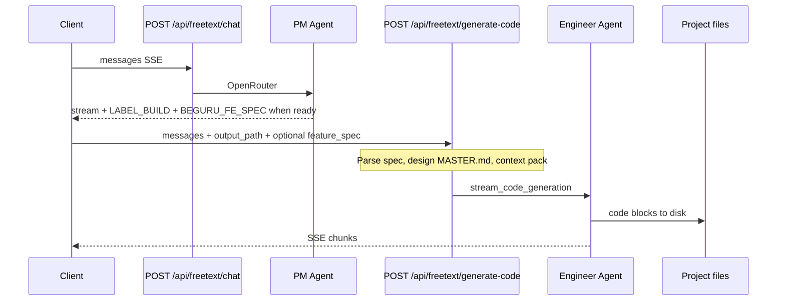
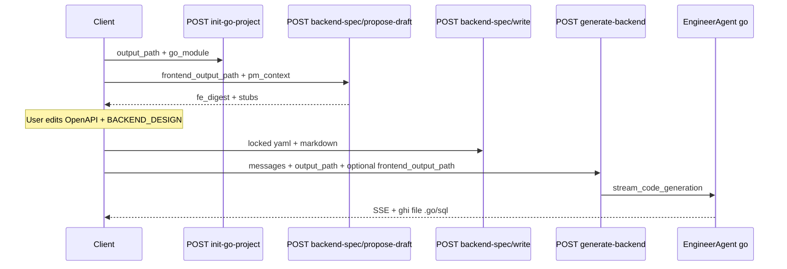
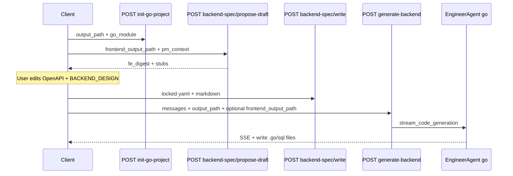

## VI

### Tóm lược

- **FastAPI** là lớp HTTP; **AgentOS (Agno)** giữ registry agent; router tách **`/api/freetext/*`**, **`/api/workflows/*`**, **`/api/agents/*`**, **`/api/interview/*`**.
- PM / Engineer / các agent khác gọi **OpenRouter** (Referer + title headers); output code ghi **`projects_root_dir`**, đọc **template** và **`design-system/`** đã mô tả ở bài trước.
- Hai sequence chính: **chat SSE → PM → handoff spec** rồi **generate-code → Engineer → file**; nhánh **Go** dùng gate `backend-spec` và quy ước `frontend_<slug>` / `backend_<slug>`.

### Giới thiệu

Đây là **Phần 2** của case study BeGuru. Bài trước nói **artifact thiết kế trên đĩa**; bài này mô tả **runtime** — process đang chạy trên VPS/container, cách request đi qua API và agent tới LLM và filesystem. Nguồn tham chiếu: `docs/ARCHITECTURE_RUNTIME.md` trong repo **beguru-ai**.

### Sơ đồ tổng quan (từ tài liệu nội bộ)

### Luồng sản phẩm chính (React / Next trước)

**Gợi ý số liệu case study:** đo **thời gian wall-clock** một vòng `generate-code` đại diện; log **số chunk SSE** hoặc **kích thước response** (sau khi ẩn PII) để minh họa biến thiên theo scope.

### Luồng Go backend (sau FE, có gate)

Quy ước path dưới `projects_root_dir`: segment đầu **`frontend_<slug>`** / **`backend_<slug>`** — chi tiết contract trong `API_SPEC.md`. Sequence khái niệm:

### Bảng thành phần (rút gọn)

| Thành phần | Vai trò |
|------------|---------|
| FastAPI | HTTP, CORS, `/health`, middleware logging |
| AgentOS | Registry agent, route framework |
| OpenRouter | Một cổng model; attribution headers |
| `projects_root_dir` | Cây project sinh ra (FE/BE) |
| Langfuse / StructuredLogger | Quan sát (tuỳ cấu hình) |

### Ảnh minh họa — prompt cho Gemini

1. **Hero “một cổng API, nhiều router”** — *English:* “Isometric server rack with one glowing gateway labeled ‘API’ splitting into four labeled pipes ‘freetext’, ‘workflows’, ‘agents’, ‘interview’, clean tech illustration, blue-indigo gradient, no logos.”
2. **Minh họa hai timeline** — *English:* “Two horizontal swimlanes: top lane ‘Chat PM’ with speech bubbles flowing into a document icon; bottom lane ‘Generate code’ with file icons landing on a disk stack; dashed line linking the two; minimal text.”

### Nối bài sau

**Phần 3** đi sâu **nén lịch sử**, **pins**, **context pack** và giới hạn ký tự — trích từ `MEMORY_AND_CONTEXT_LAYERS.md`.

---

## EN

### At a glance

- **FastAPI** fronts the service; **AgentOS (Agno)** holds the agent registry; routes include **`/api/freetext/*`**, **`/api/workflows/*`**, **`/api/agents/*`**, **`/api/interview/*`**.
- Agents call **OpenRouter**; generated code lands under **`projects_root_dir`**, using **templates** and per-project **`design-system/`** (Part 1).
- Main sequences: **chat → PM → spec handoff**, then **generate-code → Engineer → disk**; the **Go** path uses **backend-spec** gates and **`frontend_<slug>` / `backend_<slug>`** path rules.

### Introduction

This is **Part 2** of the BeGuru case study. Part 1 covered **design artifacts on disk**; here we focus on the **running service** — how requests flow through the API and agents to the LLM and filesystem. Reference: `docs/ARCHITECTURE_RUNTIME.md` in the **beguru-ai** repository.

### Overview diagram

(Same `mermaid` figure as in the Vietnamese section.)

### Primary product flow (React / Next first)

**Case-study metrics to add:** wall-clock for a representative **`generate-code`** run; SSE chunk count or sanitized response size vs scope.

### Go backend flow (after FE, gated)

Path rules: leading segment **`frontend_<slug>`** / **`backend_<slug>`** — see `API_SPEC.md`. Conceptual sequence:

### Component table (abbreviated)

| Piece | Role |
|-------|------|
| FastAPI | HTTP, CORS, `/health`, logging middleware |
| AgentOS | Agent registry, framework routes |
| OpenRouter | Unified model access; attribution headers |
| `projects_root_dir` | Generated FE/BE trees |
| Langfuse / StructuredLogger | Observability (optional / structured logs) |

### Illustrations — Gemini prompts

Use the same two English prompts as in the Vietnamese section; export PNG/WebP to `public/blog/` and embed.

### Next post

**Part 3** covers **history compression**, **pins**, **context packs**, and **character caps** — from `MEMORY_AND_CONTEXT_LAYERS.md`.
