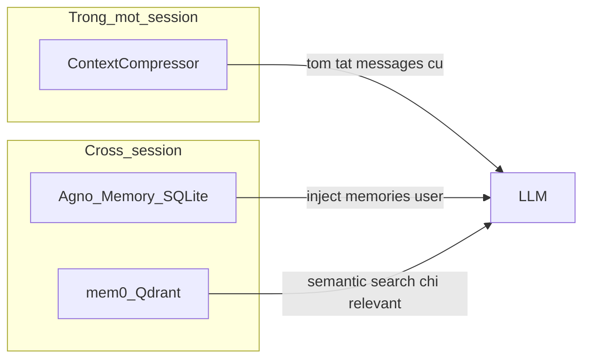
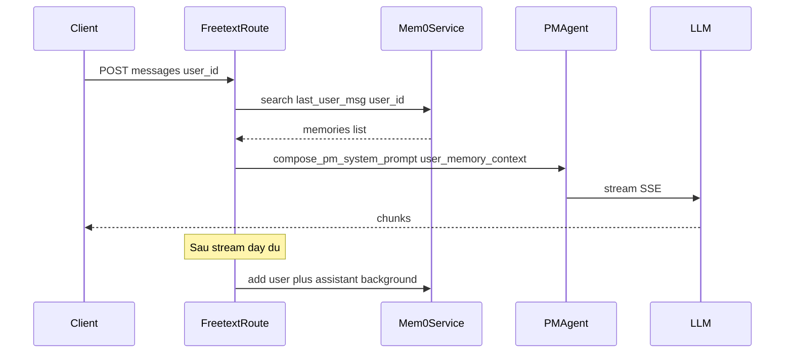

> **Chuỗi BeGuru — Technical Docs**  
> [0. Tổng quan kiến trúc](/blog/beguru-ai-architecture-overview) · [1. Design & đĩa](/blog/beguru-ai-case-study-design-system-disk) · [2. Runtime](/blog/beguru-ai-case-study-runtime-fastapi-agentos) · [3. Memory & context](/blog/beguru-ai-case-study-memory-context-layers) · **4. Mem0 & cross-session (bài này)** · [5. Technical Narrative](/blog/beguru-ai-technical-narrative)

## VI

### Tóm lược

- **`beguru-ai`** hiện **stateless** phía server cho freetext/chat: client gửi toàn bộ `messages`; **`ContextCompressor`** chỉ rút gọn **trong phiên** — không có lớp nhớ xuyên session ổn định.
- **`user_id` đã có** trong `FreetextChatRequest` (dùng cho Langfuse quota) — có thể **tận dụng** cho mem0, không cần thiết kế field mới cho mục đích này.
- Kế hoạch triển khai chi tiết: **Qdrant** làm vector store, wrapper **`AsyncMemory`**, inject **`user_memory_context`** vào `compose_pm_system_prompt()`, search trước / add sau stream trên route freetext — bài này phản ánh **plan repo**, không phải trạng thái đã merge.

:::info[Bài đọc liên quan]
Compressor, pins và artifact đĩa: [Memory & context — runtime](/blog/beguru-ai-case-study-memory-context-layers/). Mem0 bổ sung **cross-session** cho PM (và có thể mở rộng), **không** thay thế `ContextCompressor` trong một request.
:::

### Why — tình trạng & vấn đề

- Mỗi request phụ thuộc client gửi lại history; server không “nhớ” giữa các phiên chat khác nhau.
- **Agno** có built-in memory (`update_memory_on_run`), nhưng trong codebase hiện tại **chưa được wire** đúng chuỗi gọi: DB SQLite có thể được init nhưng không gắn vào agent / luồng gọi LLM thực tế đang **bypass** vòng `agent.run()` — memory Agno không kích hoạt như thiết kế mặc định.

### ContextCompressor vs Agno Memory vs mem0

- **ContextCompressor**: giảm token **trong** session — **giữ nguyên** theo plan.
- **Agno Memory** (nếu wire đúng): SQLite, thường inject theo cơ chế Agno — **effort refactor** lớn (agents, `chat_with_history`).
- **mem0**: vector store độc lập (**Qdrant** trong plan), tích hợp **ở mức route** (`freetext.py`), **additive**, semantic search theo query.

### So sánh nhanh Agno Memory vs mem0

| | Agno Memory | mem0 (plan) |
|---|-------------|-------------|
| **Effort** | Cao — refactor agent / run loop | Thấp — route + service wrapper |
| **Tìm kiếm** | SQLite text, dễ inject “tất cả” | Qdrant vector — chỉ memories **liên quan** |
| **Infra** | `data/agno.db` đã có | Thêm **Qdrant** + dependency `mem0ai` |
| **Risk** | Regression lõi agent | Ít đụng code agent cũ |

**Khuyến nghị trong plan:** ưu tiên **mem0** cho cross-session semantic memory trên `beguru-ai`.

### What — Mem0 trong kiến trúc này

[mem0ai/mem0](https://github.com/mem0ai/mem0) (Apache-2.0): lưu fact, merge/dedup, **`search(query, user_id)`**; cấu hình LLM/embedder qua **OpenRouter** (OpenAI-compatible). Vector store trong plan: **Qdrant** (`docker-compose`), không dùng SQLite thuần cho mem0 trên beguru-ai.

Tài liệu: [docs.mem0.ai](https://docs.mem0.ai).

### How — luồng POST /api/freetext/chat (theo plan)

- **Trước**: `search` theo tin nhắn user cuối + `user_id` → chuỗi inject (ví dụ section “User context từ session trước”).
- **Sau**: `add` cặp user/assistant (background task) sau khi stream xong.

### How — file & cấu hình chính (beguru-ai)

| Hạng mục | Ghi chú |
|----------|---------|
| **Infra** | Thêm service **Qdrant** trong `docker-compose` (port 6333, volume persist). |
| **Code** | `src/components/memory/mem0_service.py` — wrapper `AsyncMemory`, `build_mem0_config`, `search_user_memories`, `store_turn`. |
| **Settings** | `MEM0_ENABLED`, `MEM0_QDRANT_URL`, `MEM0_LLM_MODEL`, … (mặc định tắt feature). |
| **Prompt** | `compose_pm_system_prompt(..., user_memory_context=...)` trong `composer` / runtime. |
| **Route** | `freetext.py`: gọi search trước `compose_pm_system_prompt`; sau stream `asyncio.create_task(store_turn(...))` khi bật mem0 và có `user_id`. |

:::expand[Ví dụ khối config Python — tham khảo plan]
Vector store `provider: qdrant`, `url` từ settings; LLM/embedder trỏ OpenRouter. Tên collection (vd. `beguru_ai_memories`) và model rẻ cho extraction nằm trong `settings` — không cố định trong blog.
:::

### Điểm kỹ thuật (từ plan)

- **`AsyncMemory`**: dùng async để **không block** SSE.
- **Một instance** mem0 gắn app (`lifespan` / `app.state`), không tạo mới mỗi request.
- **Feature flag**: `MEM0_ENABLED=false` mặc định — bật dần.
- **Model extraction**: ưu tiên model **rẻ** cho bước extract của mem0 (khác model PM chính nếu cần).
- **Qdrant**: mount volume để không mất index khi restart container.

:::warning[Dữ liệu & triển khai]
Tự host Qdrant + mem0 OSS phù hợp dữ liệu nhạy cảm; kiểm tra policy trước khi dùng bất kỳ dịch vụ memory đám mây bên ngoài.
:::

### Phạm vi khác (domain-assistant)

Tích hợp mem0 vào **beguru-domain-assistant** (Guru chat, `user_memory` JSON, extraction một shot) có thể làm **theo lộ trình riêng**; **plan repo hiện tại** mà bài này bám theo **tập trung beguru-ai + Qdrant + freetext**.

### Tham chiếu

- Mem0: [github.com/mem0ai/mem0](https://github.com/mem0ai/mem0)
- Memory runtime beguru-ai: [Memory & context](/blog/beguru-ai-case-study-memory-context-layers)
- Tổng quan: [Tổng quan kiến trúc](/blog/beguru-ai-architecture-overview)

---

## EN

### At a glance

- **`beguru-ai`** is **stateless** on the server for freetext/chat: the client sends full `messages`; **`ContextCompressor`** only trims **within** a session — no durable cross-session layer yet.
- **`user_id` is already** on `FreetextChatRequest` (e.g. for Langfuse quotas) and can be **reused** for mem0 without a new field for that purpose.
- The implementation plan calls for **Qdrant**, an **`AsyncMemory`** wrapper, injecting **`user_memory_context`** into `compose_pm_system_prompt()`, and search-before / add-after-stream on the freetext route — this post reflects that **repo plan**, not necessarily merged code.

:::info[Related reading]
Compressors, pins, and on-disk artifacts: [Memory & context (runtime)](/blog/beguru-ai-case-study-memory-context-layers/). Mem0 adds **cross-session** support for the PM path (and can be extended); it does **not** replace `ContextCompressor` inside a single request.
:::

### Why — current situation

- Each request depends on the client resending history; the server does not remember across separate chat sessions.
- **Agno** has built-in memory, but in the current codebase it is **not wired** through the real call path: DB init may exist, but LLM streaming **bypasses** Agno’s normal `run()` loop — Agno memory does not activate as intended without a larger refactor.

### ContextCompressor vs Agno Memory vs mem0

(Same Mermaid `flowchart LR` as in the Vietnamese section.)

- **ContextCompressor**: in-session token reduction — **unchanged** in the plan.
- **Agno Memory** (if wired correctly): SQLite-backed; **high effort** to refactor agents / `chat_with_history`.
- **mem0**: standalone **Qdrant** vector store, integrated at **route** level — **additive**, semantic retrieval by query.

### Agno Memory vs mem0 (summary)

| | Agno Memory | mem0 (plan) |
|---|-------------|-------------|
| **Effort** | High — refactor agent / run loop | Low — route + service wrapper |
| **Retrieval** | SQLite text; may inject “all” memories | Qdrant vector — **relevant** memories only |
| **Infra** | Existing `data/agno.db` | Add **Qdrant** + `mem0ai` dependency |
| **Risk** | Core agent regression | Mostly additive |

**Plan recommendation:** prefer **mem0** for cross-session semantic memory on `beguru-ai`.

### What — Mem0 here

[mem0ai/mem0](https://github.com/mem0ai/mem0) (Apache-2.0): store facts, merge/dedup, **`search(query, user_id)`**; LLM/embedder via **OpenRouter**. Vector store in the plan: **Qdrant** (`docker-compose`), not plain SQLite for mem0 on beguru-ai.

Docs: [docs.mem0.ai](https://docs.mem0.ai).

### How — `POST /api/freetext/chat` flow

### How — main files & config (beguru-ai)

| Item | Notes |
|------|-------|
| **Infra** | **Qdrant** service in `docker-compose` (port 6333, persisted volume). |
| **Code** | `src/components/memory/mem0_service.py` — `AsyncMemory` wrapper, `build_mem0_config`, `search_user_memories`, `store_turn`. |
| **Settings** | `MEM0_ENABLED`, `MEM0_QDRANT_URL`, `MEM0_LLM_MODEL`, … (feature off by default). |
| **Prompt** | `compose_pm_system_prompt(..., user_memory_context=...)` in runtime composer. |
| **Route** | `freetext.py`: search before `compose_pm_system_prompt`; after stream `asyncio.create_task(store_turn(...))` when mem0 is on and `user_id` is set. |

:::expand[Python config sketch]
Vector store `provider: qdrant`, URL from settings; LLM/embedder point at OpenRouter. Collection name and cheap extraction model live in `settings` — not fixed in this post.
:::

### Engineering notes (from the plan)

- **`AsyncMemory`**: use async so **SSE is not blocked**.
- **Single mem0 instance** on the app (`lifespan` / `app.state`), not per request.
- **Feature flag**: `MEM0_ENABLED=false` by default — roll out gradually.
- **Extraction model**: prefer a **cheap** model for mem0’s extraction step vs the main PM model if needed.
- **Qdrant**: persist volumes so indexes survive container restarts.

:::warning[Data and ops]
Self-hosted Qdrant + OSS mem0 fits sensitive data; validate policy before any third-party hosted memory service.
:::

### Other scope (domain-assistant)

mem0 integration for **beguru-domain-assistant** (Guru chat, manual `user_memory` JSON, one-shot extraction) can follow a **separate roadmap**; the **current repo plan** this post tracks focuses on **beguru-ai + Qdrant + freetext**.

### References

- Mem0: [github.com/mem0ai/mem0](https://github.com/mem0ai/mem0)
- beguru-ai runtime memory: [Memory & context](/blog/beguru-ai-case-study-memory-context-layers)
- Overview: [Architecture overview](/blog/beguru-ai-architecture-overview)
