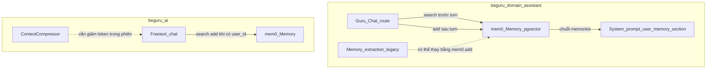
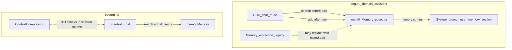

> **Chuỗi BeGuru — Technical Docs**  
> [0. Tổng quan kiến trúc](/blog/beguru-ai-architecture-overview) · [1. Design system & đĩa](/blog/beguru-ai-case-study-design-system-disk) · [2. Runtime (FastAPI, AgentOS)](/blog/beguru-ai-case-study-runtime-fastapi-agentos) · [3. Memory & context](/blog/beguru-ai-case-study-memory-context-layers) · **4. Mem0 & cross-session (bài này)**

## VI

### Tóm lược

- **beguru-domain-assistant** (Guru chat) và **beguru-ai** (PM/Engineer) hôm nay xử lý ngữ cảnh khác nhau; cả hai đều **thiếu lớp nhớ ngữ nghĩa xuyên phiên** ổn định (semantic + vector) so với JSON thủ công, extraction một shot, hoặc chỉ SQLite/key-value trong phiên.
- **[Mem0](https://github.com/mem0ai/mem0)** (Apache-2.0) là **memory layer** cho agent: trích xuất fact, dedup/merge, **tìm memories theo query** — phù hợp self-hosted với **pgvector** đã có thể dùng trong stack.
- Bài này là **thiết kế & lộ trình** (Why / What / How), **chưa** mô tả trạng thái đã merge code; triển khai theo từng **mức** (M1–M4) trong repo `guru`.

:::info[Bài đọc liên quan]
Trong phiên làm việc một request, compressor và pins vẫn được mô tả trong [Memory & context — runtime](/blog/beguru-ai-case-study-memory-context-layers/). Mem0 bổ sung **cross-session**, không thay thế toàn bộ pipeline đó.
:::

### Why — vấn đề memory hiện tại

**beguru-domain-assistant**

- `user_memory` trong request là JSON do client/ghi tay; inject vào `{user_memory_section}` — không có **tìm kiếm ngữ nghĩa** theo câu hỏi hiện tại.
- `GURU_MEMORY_EXTRACTION_PROMPT`: một LLM call sau phiên để trích JSON — dễ vỡ, không dedup mạnh, không vector search.
- Không có **cross-session** trừ khi client tự persist và gửi lại.

**beguru-ai**

- `CodebaseMemory` kiểu key-value (SQLite) — không semantic lookup toàn cục.
- `ContextCompressor` = **rút gọn trong phiên**, không phải long-term memory có chủ đích.
- Freetext: server nhận **toàn bộ `messages`** từ client; không có lớp “nhớ user” ổn định nếu không bổ sung.

### What — Mem0 là gì

[mem0ai/mem0](https://github.com/mem0ai/mem0) cung cấp:

- **Semantic memory**: thêm fact từ hội thoại, cập nhật/merge.
- **Vector search**: `memory.search(query, user_id=…)` thay vì nhét full history.
- **Đa phạm vi**: `user_id`, `agent_id`, `session_id` — khớp multi-tenant / multi-project.
- **OSS & self-hosted**: có thể gắn **OpenRouter** cho LLM/embedder và **Postgres pgvector** làm vector store.

Tài liệu upstream: [docs.mem0.ai](https://docs.mem0.ai) (từ README repo).

### How — kiến trúc đề xuất (hai dịch vụ)

### How — các mức triển khai (M1–M4)

| Mức | Phạm vi | Ý chính |
|-----|---------|---------|
| **M1** | **beguru-domain-assistant** — Guru chat | Trước turn: `memory.search` theo tin nhắn + `user_id`; inject vào `{user_memory_section}`. Sau stream: `memory.add` (ví dụ cặp turn cuối). Cấu hình mem0: pgvector + OpenRouter cho LLM/embedder. |
| **M2** | **beguru-domain-assistant** — training | Thay luồng extract một shot bằng `memory.add` transcript / turn — giảm LLM call tách biệt, nhờ mem0 extract/merge. |
| **M3** | **beguru-ai** — `POST /api/freetext/chat` | Cross-session khi có **`user_id` ổn định** từ BFF/client; search trước, add sau; `ContextCompressor` giữ nguyên vai trò trong phiên. |
| **M4** | **beguru-ai** — workflows (tuỳ chọn) | Thay/refactor `CodebaseMemory` sang mem0 với `agent_id` theo project — phức tạp nhất. |

:::warning[M3 và định danh]
M3 chỉ khả thi khi chuỗi sản phẩm có **`user_id`** (hoặc tương đương) tin cậy. Cần thống nhất BFF/Studio trước khi bật store cross-session trên beguru-ai.
:::

:::expand[Ví dụ cấu hình mem0 Python — tham khảo]
Ý tưởng từ thiết kế nội bộ: vector store **pgvector** trùng Postgres; LLM/embedder qua **OpenRouter** (base URL OpenAI-compatible). Chi tiết key/model lấy từ `settings` của từng service — không hard-code trong blog.
:::

### Quyết định kiến trúc cần chốt trước code

- **Vector DB**: dùng chung Postgres/pgvector với domain-assistant hay tách Qdrant cho beguru-ai — ảnh hưởng vận hành và backup.
- **`user_id` trên freetext**: schema request hiện có / BFF có truyền chưa; nếu chưa, M3 phải chờ contract.
- **Async**: FastAPI nên dùng **AsyncMemory** nếu SDK hỗ trợ — tránh chặn stream SSE.
- **Self-hosted vs Mem0 Platform**: dữ liệu Guru/KH nhạy cảm → ưu tiên **OSS self-hosted**, không gửi lên cloud Mem0 nếu policy yêu cầu.

### Tham chiếu

- Mem0 OSS: [github.com/mem0ai/mem0](https://github.com/mem0ai/mem0)
- Bài runtime memory (pins, compressor): [Memory & context](/blog/beguru-ai-case-study-memory-context-layers)
- Tổng quan beguru-ai: [Tổng quan kiến trúc](/blog/beguru-ai-architecture-overview)

---

## EN

### At a glance

- **beguru-domain-assistant** (Guru chat) and **beguru-ai** (PM/Engineer) handle context differently today; both lack a **stable cross-session semantic memory** layer compared to hand-written JSON, one-shot extraction, or per-session SQLite/key-value only.
- **[Mem0](https://github.com/mem0ai/mem0)** (Apache-2.0) is an **agent memory layer**: fact extraction, dedup/merge, **query-time retrieval** — fits self-hosted **pgvector** in our stack.
- This post is a **design and roadmap** (Why / What / How), **not** a statement of shipped code; implementation proceeds in **levels** (M1–M4) in the `guru` workspace.

:::info[Related reading]
Within a single request, compressors and pins are covered in [Memory & context (runtime)](/blog/beguru-ai-case-study-memory-context-layers/). Mem0 adds **cross-session** memory; it does not replace that entire pipeline.
:::

### Why — current pain points

**beguru-domain-assistant**

- `user_memory` in the request is client-managed JSON injected into `{user_memory_section}` — no **semantic retrieval** for the current user message.
- `GURU_MEMORY_EXTRACTION_PROMPT`: a separate LLM pass to extract JSON — brittle, weak dedup, no vector search.
- No **cross-session** memory unless the client persists and resends.

**beguru-ai**

- `CodebaseMemory` is key-value style (SQLite) — not global semantic lookup.
- `ContextCompressor` is **in-session** summarisation, not durable long-term memory.
- Freetext: the server receives **full `messages`** from the client; no stable “user memory” layer without an add-on.

### What — Mem0

[mem0ai/mem0](https://github.com/mem0ai/mem0) provides:

- **Semantic memory**: add facts from conversations; update/merge.
- **Vector search**: `memory.search(query, user_id=…)` instead of dumping full history.
- **Scopes**: `user_id`, `agent_id`, `session_id` — fits multi-tenant / multi-project setups.
- **OSS & self-hosted**: can wire **OpenRouter** for LLM/embedder and **Postgres pgvector** as the vector store.

Upstream docs: [docs.mem0.ai](https://docs.mem0.ai).

### How — proposed architecture

### How — rollout levels (M1–M4)

| Level | Scope | Summary |
|-------|-------|---------|
| **M1** | **beguru-domain-assistant** — Guru chat | Before turn: `memory.search` on message + `user_id`; inject into `{user_memory_section}`. After stream: `memory.add` (e.g. last user/assistant turns). Config: pgvector + OpenRouter for LLM/embedder. |
| **M2** | **beguru-domain-assistant** — training | Replace one-shot extract with `memory.add` on transcript/turns — fewer bespoke LLM calls; mem0 handles extraction/merge. |
| **M3** | **beguru-ai** — `POST /api/freetext/chat` | Cross-session when a stable **`user_id`** exists from BFF/client; search before, add after; keep `ContextCompressor` for within-session limits. |
| **M4** | **beguru-ai** — workflows (optional) | Refactor/replace `CodebaseMemory` with mem0 scoped by `agent_id` per project — highest effort. |

:::warning[M3 and identity]
M3 requires a trusted **`user_id`** (or equivalent) from the BFF/client. Align the product chain before enabling cross-session storage on beguru-ai.
:::

:::expand[Sample mem0 config sketch]
Same idea as internal design: **pgvector** on Postgres; LLM/embedder via **OpenRouter** (OpenAI-compatible base URL). Keys and model IDs belong in each service’s `settings`, not in this blog post.
:::

### Architecture decisions before coding

- **Vector store**: shared Postgres/pgvector with domain-assistant vs separate Qdrant for beguru-ai — ops and backup impact.
- **`user_id` on freetext**: whether the BFF already sends it; if not, M3 waits on API contract.
- **Async**: prefer **AsyncMemory** where available so SSE streams are not blocked.
- **Self-hosted vs Mem0 Platform**: sensitive Guru/customer data → prefer **OSS self-hosted**, avoid Mem0 cloud if policy requires.

### References

- Mem0 OSS: [github.com/mem0ai/mem0](https://github.com/mem0ai/mem0)
- Runtime memory (pins, compressor): [Memory & context](/blog/beguru-ai-case-study-memory-context-layers)
- beguru-ai overview: [Architecture overview](/blog/beguru-ai-architecture-overview)
